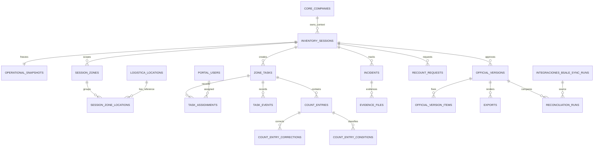

# Modelo de Datos Conceptual y Logico - Inventory Engine

## 1. Objetivo

Este documento define el modelo conceptual y logico del esquema `inventarios` para Inventory Engine. Es la base del diseno fisico posterior de columnas, constraints, indices, RLS, funciones, migraciones y servicios. No define tablas SQL, tipos de datos, claves fisicas ni endpoints.

El modelo representa jornadas de inventario, sus snapshots operacionales, tareas, conteos, incidencias, reconteos, consolidaciones, valorizaciones, versiones oficiales, exportaciones y conciliaciones. Respeta que Bsale es la fuente de stock inicial en la primera version, Excel es una salida de una version oficial y PetGrup es propietario del resultado del Engine.

## 2. Principios de modelado

### Ownership Rule

`inventarios` es propietario solo de informacion propia del proceso de inventario. No modifica ni replica permanentemente maestros de otros esquemas. Cada referencia externa conserva el identificador de su entidad propietaria y el Snapshot Operacional copia solo el contexto necesario para historia reproducible.

### Referencias frente a snapshots

La operacion usa referencias vivas a empresa, usuarios, productos, bodegas y ubicaciones. Al iniciar una jornada, el Snapshot Operacional preserva el catalogo relevante, stock teorico Bsale, costo unitario historico informado por Bsale, ubicaciones seleccionadas, alcance, configuracion, reglas y contexto de asignaciones. El snapshot es inmutable y no sustituye a los maestros vivos.

### Multiempresa

La raiz de toda jornada pertenece a una empresa. Sus agregados hijos heredan ese contexto; conservar `company_id` en entidades de alto volumen, acceso directo o evidencia es conceptualmente redundante pero conveniente para aislamiento, seguridad, consultas y prevencion de relaciones cruzadas. Toda referencia a bodega, ubicacion, producto Bsale o ejecucion de sync debe corresponder a la misma empresa de la jornada.

### Inmutabilidad, auditoria y no eliminacion

Los aportes, correcciones, eventos, evidencias, snapshots, versiones y resultados aprobados conservan historial. Las correcciones son nuevos hechos relacionados con el original; no hay sobreescritura silenciosa ni eliminacion fisica de evidencia funcional. `portal.audit_logs` complementa el registro funcional propio de `inventarios`; no lo reemplaza.

### Concurrencia e idempotencia

Los limites transaccionales protegen una tarea de zona, una asignacion activa por zona, una zona abierta por usuario, la validacion de tareas, la aprobacion de una version y la conciliacion. Los ingresos offline requieren identificadores de operacion idempotentes y orden verificable. El modelo no define todavia locks ni mecanismos SQL.

## 3. Mapa de dominios y esquemas

```text
PetGrup PostgreSQL / Supabase
|
+-- core
|   `-- core.companies, core.user_company_access
+-- portal
|   `-- portal.users, portal.roles, portal.permissions, portal.audit_logs
+-- adquisiciones
|   `-- adquisiciones.products, adquisiciones.warehouses
+-- logistica
|   `-- logistica.locations, logistica.location_layouts, kardex
+-- integraciones
|   `-- Bsale mirrors and sync executions
`-- inventarios
    `-- Inventory Engine aggregates and functional events
```

Dependencias permitidas: `inventarios` consume referencias de los esquemas externos y conserva snapshots propios. `integraciones` sigue siendo propietario de espejos Bsale, ejecuciones y conectores. Dependencias prohibidas: `inventarios` no crea ni actualiza empresas, usuarios, productos, bodegas, ubicaciones, Kardex, stock Bsale o ejecuciones de Sync.

## 4. Agregados principales

| Agregado / raiz | Responsabilidad, entidades internas y limite transaccional |
| --- | --- |
| **Inventory Session / session** | Jornada, tipo, alcance, ciclo `DRAFT` a `RECONCILED` o `CANCELLED`, referencia a rectificacion y proveedor. Agrupa zonas operacionales, Snapshot Operacional, reglas y tareas. Protege transiciones de jornada y unicidad de la operacion por zona. |
| **Operational Snapshot / operational_snapshot** | Cabecera y componentes congelados de productos, stock, costos de recepcion, ubicaciones, configuracion, reglas y contexto. Se crea al inicio; desde entonces es inmutable. |
| **Zone Task / zone_task** | Tarea asignada a una zona operacional, asignaciones y eventos. Estado persistente limitado a `ASSIGNED`, `IN_PROGRESS`, `PAUSED`, `COMPLETED`. Protege apertura exclusiva de usuario y zona. |
| **Counting / count_entry** | Aportes originales, correcciones append-only y desglose de condiciones fisicas. Protege idempotencia y evita sobrescritura del aporte original. |
| **Incident / incident** | Incidencia, resolucion, evidencia y bloqueos. Permite `OPEN`, `UNDER_REVIEW`, `RESOLVED`, `CLOSED`; severidad `INFORMATIONAL`, `OPERATIONAL`, `CRITICAL`, `BLOCKING`. |
| **Recount / recount_request** | Solicitud, tareas ciegas, conteos candidatos, seleccion definitiva, justificacion y confianza derivada. No limita el numero de reconteos. |
| **Consolidation / consolidation_result** | Resultados preliminares, validados y oficiales por producto, derivados de tareas y decisiones validas. Protege validacion concurrente y no admite edicion manual. |
| **Official Version / official_version** | Resultado aprobado, detalle inmutable, hash y rectificaciones vinculadas. Protege una sola aprobacion/version oficial para una sesion o rectificacion. |
| **Export / export_request** | Solicitud, archivo, formato, hash, descargas y regeneraciones vinculados a una version oficial. No modifica resultado ni stock. |
| **Reconciliation / reconciliation_run** | Observacion posterior Bsale, resultados por SKU, diferencias, justificaciones, aprobacion de cierre y referencia a Sync oficial. |
| **Functional Audit / functional_event** | Eventos propios del proceso, append-only, con actor, contexto, fecha, cliente e idempotencia. No toma decisiones. |

## 5. Catalogo conceptual de entidades

| Entidad conceptual | Nombre tecnico sugerido | Responsabilidad y relaciones | Persistencia / mutabilidad |
| --- | --- | --- | --- |
| Jornada | `sessions` | Raiz. Pertenece a empresa; referencia bodega, proveedor, sucursal, responsable y sesion rectificada cuando corresponda. Una jornada tiene un snapshot, zonas, tareas, resultados y versiones. | Persistida; editable hasta `APPROVED`; luego inmutable salvo eventos posteriores. |
| Zona operacional | `session_zones` | Abstraccion propia de la jornada. En V1 corresponde exactamente a una ubicacion individual viva de `logistica.locations`; una futura version puede agrupar ubicaciones. | Persistida; definible antes de iniciar; fijada por snapshot. |
| Membresia de zona | `session_zone_locations` | Relacion entre zona operacional y ubicacion viva de Logistica. En V1 tiene exactamente una membresia; permite agrupaciones futuras sin crear maestro alternativo. | Persistida; modificable solo antes de snapshot; historico copiado al snapshot. |
| Snapshot operacional | `operational_snapshots` | Cabecera de referencias y fecha de corte; pertenece 1:1 a jornada iniciada. | Persistida; inmutable desde creacion. |
| Producto snapshot | `snapshot_products` | Producto relevante, identidad externa/local, descripcion y codigos vigentes al inicio. Referencia viva opcional a `adquisiciones.products`. | Persistida, inmutable. |
| Stock snapshot | `snapshot_stock` | Stock teorico Bsale por producto/variante/sucursal y su procedencia. | Persistida, inmutable. |
| Costo snapshot | `snapshot_receipt_costs` | Costo unitario historico informado por Bsale, o fallback identificado, congelado por producto/variante con evidencia de origen. | Persistida, inmutable. |
| Ubicacion snapshot | `snapshot_locations` | Codigo, nombre, bodega, pasillo, rack, nivel, posicion, estado y referencia viva de la ubicacion seleccionada. | Persistida, inmutable. |
| Configuracion snapshot | `snapshot_configuration` | Alcance, reglas vigentes, proveedor y configuracion aplicable. | Persistida, inmutable. |
| Tarea de zona | `zone_tasks` | Tarea de una zona operacional y una jornada; referencia a asignacion actual. | Persistida; estado solo `ASSIGNED`, `IN_PROGRESS`, `PAUSED`, `COMPLETED`. |
| Asignacion | `task_assignments` | Relacion historica entre tarea y usuario. Conserva reasignaciones y abandono. | Persistida; append-only por cambio de responsable. |
| Evento de tarea | `task_events` | Eventos `STARTED`, `RESUMED`, `REOPENED`, `REASSIGNED`, `VALIDATED`, `INVALIDATED`, `CANCELLED`, pausas y cierres. | Append-only; no es estado persistente. |
| Aporte de conteo | `count_entries` | Registro original de cantidad por tarea, producto snapshot y usuario. | Persistida; append-only. |
| Correccion | `count_entry_corrections` | Nueva decision sobre un aporte; conserva valor anterior, nuevo, motivo y actor. | Append-only; no reemplaza aporte. |
| Condicion fisica | `count_entry_conditions` | Desglose mutuamente excluyente `AVAILABLE`, `DAMAGED`, `EXPIRED`, `BLOCKED`, `OTHER_UNAVAILABLE`. | Persistida; correccion mediante nuevo hecho relacionado. |
| Incidencia | `incidents` | Excepcion ligada a jornada, zona, tarea y/o producto; contiene severidad, estado y bloqueo. | Persistida; resoluble, nunca eliminada. |
| Resolucion de incidencia | `incident_resolutions` | Decision, responsable, fecha y justificacion. | Append-only; la incidencia conserva estado actual derivado. |
| Evidencia | `evidence_files` | Metadato de archivo privado vinculado a incidencia, conteo o tarea; conserva bucket, path, hash, contexto e identificador offline. | Persistida; archivo y metadato no se eliminan fisicamente. |
| Reconteo | `recount_requests` | Solicitud y alcance de reconteo por producto/resultado. | Persistida; editable hasta asignarse/cerrarse. |
| Decision de reconteo | `recount_decisions` | Seleccion explicita del resultado definitivo y justificacion de supervisor. | Persistida; inmutable al decidir. |
| Resultado consolidado | `consolidation_results` | Cantidad y diferencia derivadas por producto, con etapa preliminar, validada u oficial. | Derivada y materializable; oficial persistido por auditoria. |
| Valorizacion | `valuation_results` | Impacto economico derivado usando solo costo snapshot. | Derivada y persistible en version oficial. |
| Version oficial | `official_versions` | Resultado aprobado, secuencia, hash y vinculo de rectificacion/origen. | Persistida e inmutable desde aprobacion. |
| Detalle oficial | `official_version_items` | Resultado por producto y condicion de una version. | Persistida e inmutable. |
| Exportacion | `exports` | Solicitud, formato, resultado, archivo y estado de generacion. | Persistida; regeneraciones son nuevos registros. |
| Descarga | `export_downloads` | Evidencia de acceso a un archivo exportado. | Append-only. |
| Conciliacion | `reconciliation_runs` | Comparacion posterior contra stock Bsale y `integraciones.bsale_sync_runs.id`. | Persistida; cada ejecucion es historica. |
| Resultado de conciliacion | `reconciliation_items` | Copia inmutable de stock aprobado y observado por empresa, variante y oficina; conserva coincidencia, diferencia, justificacion y decision. | Persistida; append-only por ejecucion. |
| Evento funcional | `functional_events` | Bitacora de hechos del Engine y operaciones offline. | Append-only. |

## 6. Relaciones con entidades externas verificadas

| Referencia desde `inventarios` | Entidad real confirmada | Uso permitido |
| --- | --- | --- |
| Empresa | `core.companies` | Contexto empresarial de la jornada. Definida en `supabase/migrations/20260616120000_multi_company.sql`. |
| Acceso empresa-usuario | `core.user_company_access` | Validar participacion activa del usuario en la empresa; referencia a `portal.users` y `core.companies`. |
| Usuario | `portal.users` | Creador, responsable, contador, supervisor, aprobador, exportador y conciliador. `portal.users.id` referencia `auth.users(id)`. |
| Rol y permisos | `portal.roles`, `portal.permissions`, `portal.role_permissions`, `portal.user_permissions` | Autorizacion externa; no se copian como maestro. |
| Producto | `adquisiciones.products` | Referencia viva para operar; puede ser global (`company_id` nulo) o propio de empresa. Snapshot conserva contexto historico. |
| Bodega | `adquisiciones.warehouses` | Bodega oficial; pertenece a `core.companies`. |
| Ubicacion | `logistica.locations` | Maestro vivo de ubicaciones. Tiene `company_id`, `warehouse_id`, `code`, `aisle`, `rack`, `level`, `position`; no tiene entidad de zonas. |
| Layout | `logistica.location_layouts` | Solo fuente opcional de agrupacion visual `layout_group`; no es maestro de zonas de inventario. |
| Stock Bsale | `integraciones.bsale_stock_current` | Fuente de snapshot por `company_id`, variante y oficina; vincula `bsale_sync_run_id`. |
| Costo de recepcion | `integraciones.bsale_receptions` y `integraciones.bsale_reception_details` | Fuente primaria del costo unitario historico informado por Bsale. La relacion detalle-cabecera es logica: `bsale_reception_id` con `bsale_receptions.bsale_id`; no existe FK declarada. |
| Ejecucion Bsale | `integraciones.bsale_sync_runs` | Referencia oficial del espejo de stock y de la conciliacion; `bsale_stock_current.bsale_sync_run_id` identifica la corrida que actualizo cada fila. |
| Sync generico | `integraciones.sync_runs` | Core alternativo de sincronizaciones; no es la referencia oficial de conciliacion de stock Bsale. |
| Auditoria ERP | `portal.audit_logs` | Auditoria transversal complementaria; el Engine conserva ademas eventos funcionales propios. |
| Archivos | Supabase Storage; patrones privados `recepciones` y `rendicion-rutas` | Referencia de bucket y path; el bucket definitivo de inventarios se definira fisicamente despues. |

En V1, una `session_zone` corresponde exactamente a una unica `logistica.locations`. La abstraccion y la membresia se conservan para permitir agrupaciones controladas en una version futura. Esto es necesario porque `logistica.locations` solo modela ubicaciones individuales y `location_layouts.layout_group` es una agrupacion visual sin membresia funcional de zona. No se duplica el catalogo maestro: se guardan referencias y el snapshot historico. `layout_group` no se usa como agrupacion funcional.

## 7. Modelo de Snapshot Operacional

La cabecera `operational_snapshots` identifica la jornada, empresa, proveedor, instante de inicio, alcance y ejecucion de Sync usada. Sus componentes inmutables son:

- `snapshot_products`: catalogo relevante, SKU, codigos, descripcion, variante y referencias vivas.
- `snapshot_stock`: stock teorico Bsale por variante/producto, sucursal y fuente de sincronizacion.
- `snapshot_receipt_costs`: costo unitario historico informado por Bsale, tomado de la ultima `integraciones.bsale_reception_details.cost` aplicable antes del inicio del snapshot. Relaciona detalle y cabecera Bsale, resuelve producto por `bsale_variant_id` y usa SKU/codigo de variante solo como respaldo.
- `snapshot_receipt_costs`: conserva valor, tipo de fuente, prioridad de fallback, identificador de fuente, recepcion, fecha, documento, variante, SKU, ejecucion de sincronizacion y condicion de costo no disponible. Nunca sustituye silenciosamente un costo por cero.
- `snapshot_locations`: bodega, ubicacion, codigo, nombre, pasillo, rack, nivel, posicion, estado y relacion con zona operacional.
- `snapshot_configuration`: reglas, alcance, configuracion, usuarios asignados cuando corresponda y referencia al proveedor.

El orden de fallback de costo es: recepcion interna o Kardex vinculado a recepcion y orden de compra; `integraciones.bsale_variant_costs.average_cost`; `adquisiciones.product_supplier_mappings.unit_cost`; y valor nulo controlado. Cada fallback debe quedar identificado como tal y no debe denominarse costo neto contable.

Las copias historicas no sustituyen las referencias vivas. Un cambio posterior en `logistica.locations`, producto, costo o Bsale no altera la jornada historica. Una desactivacion o modificacion posterior de ubicacion en Logistica no modifica su zona ni snapshot historico.

## 8. Modelo de tareas y eventos

`zone_tasks` conserva solo el estado operacional actual: `ASSIGNED`, `IN_PROGRESS`, `PAUSED` o `COMPLETED`. `task_assignments` registra responsables en el tiempo. `task_events` conserva hechos auditables, incluidos `STARTED`, `RESUMED`, `REOPENED`, `REASSIGNED`, `VALIDATED`, `INVALIDATED` y `CANCELLED`; ninguno es estado persistente.

Una reapertura devuelve la tarea a un estado operativo valido y suspende temporalmente su contribucion previamente validada. Una reasignacion crea nuevo historial de asignacion sin borrar conteos. Una invalidacion excluye la contribucion afectada sin borrar evidencia. Una validacion de supervisor permite que el resultado preliminar de una tarea `COMPLETED` entre al consolidado oficial.

La raiz `zone_tasks` protege simultaneamente una tarea activa por zona y una zona abierta por usuario. Los eventos de apertura, cierre, reapertura, reasignacion e invalidacion son operaciones de concurrencia critica.

## 9. Modelo de conteos

El aporte original (`count_entries`) pertenece a tarea, producto snapshot, usuario y operacion idempotente. Las condiciones fisicas se relacionan al aporte y deben cumplir:

```text
physical_quantity = available_quantity + damaged_quantity + expired_quantity
                  + blocked_quantity + other_unavailable_quantity
```

Las condiciones principales son mutuamente excluyentes por unidad. Caja abierta o envase deteriorado que no afecten comercializacion son incidencias, no una segunda condicion fisica.

Una correccion crea `count_entry_corrections` relacionado al aporte y conserva valor previo, nuevo valor, motivo, usuario y fecha. Un aporte adicional suma como hecho independiente. Un conteo preliminar deriva de aportes vigentes de una tarea; un conteo validado deriva de una tarea `COMPLETED` con evento `VALIDATED`; uno invalidado se conserva y queda excluido. Los reconteos generan aportes separados y `recount_decisions` selecciona explicitamente el resultado definitivo. No existe promedio automatico ni reemplazo destructivo.

## 10. Modelo de consolidacion

`consolidation_results` representa proyecciones por producto del snapshot y usa exclusivamente tareas `COMPLETED` con evento `VALIDATED` vigente y decisiones de reconteo aplicables. El resultado preliminar de una tarea existe solo como resumen de esa tarea y no participa en consolidacion.

- **Validado:** consolida exclusivamente tareas validadas y decisiones de reconteo aplicables.
- **Oficial:** queda fijado como detalle de `official_versions` al aprobar.

Una reapertura de zona validada retira temporalmente su aporte del resultado validado; el resultado historico previo se conserva. Una invalidacion excluye el aporte o tarea afectada. La consolidacion nunca permite editar totales: recalcula desde aportes, correcciones, eventos y decisiones.

Avance, cobertura, diferencias, exactitud y resultados preliminares pueden ser vistas, vistas materializadas o proyecciones. El resultado oficial, sus detalles y la valorizacion utilizada en aprobacion deben persistirse para auditoria.

## 11. Modelo de incidencias y evidencias

`incidents` es distinto de condiciones fisicas. Puede relacionarse con jornada, zona, tarea, aporte y producto snapshot. Tiene severidad `INFORMATIONAL`, `OPERATIONAL`, `CRITICAL` o `BLOCKING`, y estado `OPEN`, `UNDER_REVIEW`, `RESOLVED` o `CLOSED`.

Una incidencia `CRITICAL` bloquea aprobacion. Una `BLOCKING` puede impedir continuar o cerrar la operacion definida. `incident_resolutions` conserva decisiones. `evidence_files` asocia metadatos de fotografias u otros archivos privados con su bucket, path, hash, contexto e identificador offline; no reemplaza la politica de Storage del ERP.

El binario reside en el futuro bucket privado `inventory-evidence`; los metadatos funcionales residen en `inventarios`. La ruta conceptual es `<company_id>/sessions/<session_id>/incidents/<incident_id>/<evidence_id>/<sha256>.<ext>` y admite rutas equivalentes bajo `tasks/<task_id>` o `counts/<count_entry_id>`. No se persisten URLs publicas ni URLs firmadas. El acceso se realiza mediante URLs firmadas temporales autorizadas.

Los formatos iniciales son `image/jpeg`, `image/png`, `image/webp` y `application/pdf`, con limite conceptual de 20 MB por archivo. Clientes no pueden eliminar fisicamente objetos. Android conserva un identificador offline idempotente y solo marca evidencia como sincronizada cuando el objeto y sus metadatos fueron confirmados por servidor.

Incidencias, evidencia, resoluciones y eventos son capacidades potencialmente reutilizables por otros modulos, pero en esta fase pertenecen funcionalmente a `inventarios` y no modifican otros esquemas.

## 12. Modelo de versiones oficiales

`official_versions` se crea al aprobar y es la fuente oficial interna. Tiene identificador, numero de version, hash, actor, fecha, origen y estado inmutable. `official_version_items` fija el resultado consolidado y valorizado por producto y condicion.

Una rectificacion es una nueva jornada vinculada a la version o jornada original. Conserva los valores originales y los corregidos en versiones separadas; sigue su propia revision, aprobacion, exportacion y conciliacion. La jornada y version originales nunca se modifican.

## 13. Modelo de exportacion

`exports` representa una solicitud de salida para una unica `official_version`: formato, finalidad, estado, hash de contenido y archivo generado. `evidence_files` o una referencia especializada conserva bucket/path. `export_downloads` registra descarga, usuario, fecha y contexto.

Una regeneracion crea una nueva exportacion trazable, no altera el archivo previo. Excel es una representacion de la version oficial, nunca la fuente de verdad. El archivo oficial para Bsale y los reportes complementarios se relacionan a la misma version fuente.

## 14. Modelo de conciliacion

`reconciliation_runs` se inicia despues de importacion manual en Bsale y de la sincronizacion oficial. Referencia la version oficial, proveedor, usuario e `integraciones.bsale_sync_runs.id` que actualizo el stock observado.

La ejecucion valida pertenece a la misma empresa, es posterior a la importacion manual, tiene estado `COMPLETED`, fecha de termino, ausencia de error y es la corrida que efectivamente actualizo las filas conciliadas de `integraciones.bsale_stock_current`. La comparacion se realiza por `company_id + variant_id + office_id`, nunca solo por SKU.

`reconciliation_items` conserva una copia inmutable por esa clave de stock aprobado, stock Bsale posterior, coincidencia o diferencia, justificacion y decision. Esto es obligatorio porque `bsale_stock_current` es un espejo mutable. La conciliacion no edita la version aprobada. El cierre autorizado de una ejecucion permite la transicion de la jornada `EXPORTED` a `RECONCILED`.

## 15. Entidades derivadas

Los siguientes conceptos son candidatos a vistas, vistas materializadas, consultas o proyecciones posteriores, no maestros editables:

- Avance por jornada, zona, tarea y usuario.
- Cobertura de SKU, SKU adicionales y SKU sin conteo.
- Exactitud por SKU, unidades y valorizacion.
- Productividad, tiempos y actividad por usuario.
- Nivel de confianza de reconteos.
- Diferencias y valorizacion economica preliminar.
- Estado de sincronizacion offline y pendientes de evidencia.
- Estado de bloqueos de aprobacion y conciliacion.

## 16. Diagrama logico



## 17. Matriz de mutabilidad

| Entidad | Editable | Append-only | Inmutable desde | Eliminacion fisica |
| --- | --- | --- | --- | --- |
| `sessions` | Si, hasta `APPROVED` | Eventos relacionados | `APPROVED` | No |
| `operational_snapshots` y componentes | No posterior | No | Creacion | No |
| `session_zones` | Si, antes de snapshot | Membresias historicas | Snapshot | No |
| `zone_tasks` | Solo estado operativo autorizado | Eventos/asignaciones | `COMPLETED` salvo reapertura | No |
| `count_entries` | No | Si | Creacion | No |
| `count_entry_corrections` | No | Si | Creacion | No |
| `incidents` | Estado/resolucion autorizada | Resoluciones/evidencia | Cierre | No |
| `evidence_files` | No directo | Si | Confirmacion de objeto y metadatos | No |
| `recount_decisions` | No | Si | Decision | No |
| `consolidation_results` | No directo | Proyecciones/recalculos | Version oficial | No |
| `official_versions` y detalles | No | Si | Aprobacion | No |
| `exports`, descargas y conciliaciones | No directo | Si | Creacion | No |
| `functional_events` | No | Si | Creacion | No |

## 18. Matriz de propiedad

| Entidad | Esquema propietario | Consumidores | Escritura permitida |
| --- | --- | --- | --- |
| Empresas y acceso empresa | `core` | Todos los dominios | Solo `core` |
| Usuarios, roles, permisos, auditoria transversal | `portal` | Todos los dominios | Solo `portal` |
| Productos y bodegas | `adquisiciones` | `inventarios`, Logistica, otros | Solo `adquisiciones` |
| Ubicaciones, layouts, Kardex | `logistica` | `inventarios`, otros | Solo `logistica` |
| Espejos Bsale y Sync | `integraciones` | `inventarios`, analitica | Solo `integraciones` |
| Jornadas, snapshots, tareas, conteos, incidencias, reconteos, resultados, versiones, exportaciones, conciliaciones y eventos | `inventarios` | Portal, Android, reportes autorizados | Solo limites autorizados de `inventarios` |

## 19. Incertidumbres no bloqueantes

1. **Significado tributario exacto:** el repositorio confirma que `integraciones.bsale_reception_details.cost` es el costo unitario historico informado por Bsale, pero no confirma si es neto de impuestos, descuentos, gastos o prorrateos. La fuente y su etiquetado quedan fijados; una validacion documental de Bsale podra precisar su semantica tributaria sin redisenar el modelo.
2. **Estado real de datos y migraciones en produccion:** la auditoria verifico migraciones y codigo versionados, no una instancia runtime. Debe verificarse de forma autorizada antes de operar que los espejos Bsale y sus ejecuciones contengan los datos esperados.
3. **Validacion operativa de conciliacion:** el modelo fija `integraciones.bsale_sync_runs.id` como ejecucion oficial, pero debe probarse una conciliacion completa con una corrida real posterior a una importacion Bsale.
4. **Capacidad y retencion de evidencias:** el bucket, privacidad, formatos y limite inicial estan definidos. La cuota total por jornada y el periodo definitivo de retencion requieren politica operativa o normativa posterior.

## 20. Veredicto

El modelo conceptual y logico esta preparado para pasar al diseno fisico de entidades, columnas, claves primarias, claves foraneas, constraints, indices, RLS, funciones y migraciones del esquema `inventarios`. Las cuatro incertidumbres registradas no bloquean ese diseno.

Mantiene el esquema exacto `inventarios`, no duplica maestros, conserva `logistica.locations` como maestro vivo, fija una ubicacion por zona en V1, usa Snapshot Operacional inmutable, consolida solo tareas validadas, trata reaperturas, reasignaciones, validaciones, invalidaciones y cancelaciones como eventos, conserva versiones aprobadas inmutables y vincula rectificaciones, exportaciones y conciliaciones a la version oficial correspondiente.
