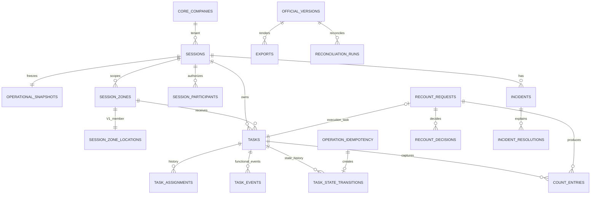

# Modelo de Datos Fisico - Inventory Engine

## 1. Objetivo, alcance y convenciones

Esta especificacion define los objetos PostgreSQL/Supabase del esquema compartido `inventarios`. No contiene SQL ejecutable, migraciones, funciones, politicas, triggers, buckets ni codigo. Las Fases 1-3 aplicadas son inmutables; las estructuras de Fase 4 se crean exclusivamente en nuevas migraciones.

`inventarios` es propietario de datos del proceso y consume maestros sin duplicarlos: `core.companies`, `portal.users`, `adquisiciones.products` y `warehouses`, `logistica.locations` e `integraciones`/Bsale. Bsale conserva la fuente externa de stock; una version oficial futura es la fuente interna del resultado aprobado.

| Aspecto | Convencion |
| --- | --- |
| PK | `uuid`, `PRIMARY KEY`, `DEFAULT gen_random_uuid()` |
| Tenant | `company_id uuid NOT NULL REFERENCES core.companies(id) ON DELETE RESTRICT` |
| Actores | FK a `portal.users(id) ON DELETE RESTRICT` |
| Fechas | `timestamptz`, normalmente `NOT NULL DEFAULT now()` |
| Catalogos | `text` con `CHECK`, no enums PostgreSQL |
| Relaciones internas | FK y candidate keys compuestas con `company_id` |
| Mutaciones | RPC autorizada; RLS y triggers definitivos en 4E |

Toda tabla propia tiene `id`, `company_id`, `created_at` y `created_by` salvo proyecciones estrictamente derivadas. Las mutables tienen `updated_at` y `updated_by` cuando son necesarios. Referencias externas sin candidate key compuesta se validan por RPC o trigger de integridad.

## 2. Catalogos cerrados

| Campo | Valores permitidos |
| --- | --- |
| `sessions.status` | `DRAFT`, `PREPARED`, `COUNTING`, `UNDER_REVIEW`, `APPROVED`, `EXPORTED`, `RECONCILED`, `CANCELLED` |
| `sessions.inventory_type` | `GENERAL`, `PARTIAL`, `CYCLIC`, `CONTROL`, `RECOUNT` |
| `tasks.status` | `ASSIGNED`, `IN_PROGRESS`, `PAUSED`, `COMPLETED` |
| `tasks.task_kind` | `PRIMARY`, `RECOUNT` |
| `task_events.event_type` | `STARTED`, `RESUMED`, `REOPENED`, `REASSIGNED`, `VALIDATED`, `INVALIDATED`, `CANCELLED` |
| `task_state_transitions.transition_type` | `STARTED`, `PAUSED`, `RESUMED`, `COMPLETED`, `REOPENED` |
| `count_entries.capture_source` | `MOBILE`, `WEB` |
| incidencia | severidad `INFORMATIONAL`, `OPERATIONAL`, `CRITICAL`, `BLOCKING`; estado `OPEN`, `UNDER_REVIEW`, `RESOLVED`, `CLOSED` |
| reconteo | `REQUESTED`, `ASSIGNED`, `IN_PROGRESS`, `COMPLETED`, `CANCELLED` |

`PAUSED` y `COMPLETED` son estados persistentes de `tasks` y tipos de `task_state_transitions`. No se agregan a `task_events.event_type`.

## 3. Catalogo de tablas

El modelo propone 34 tablas: 22 aplicadas en Fases 1-3, 2 nuevas de Fase 4 y 10 de consolidacion, versionado, exportacion, conciliacion y auditoria funcional futuras.

### 3.1 Jornada, alcance y snapshot

| Tabla | Columnas e integridad principales |
| --- | --- |
| `sessions` | jornada raiz; numero unico por empresa; tipo, estado, bodega, oficina Bsale, alcance, responsable, rectificacion y hitos. Candidate keys `(company_id,id)` y `(company_id,session_number)`. |
| `session_product_scopes` | inclusiones/exclusiones de producto para PARTIAL; UNIQUE `(company_id,session_id,bsale_variant_id)`. |
| `session_location_scopes` | alcance declarativo de ubicacion; UNIQUE `(company_id,session_id,location_id)`. |
| `session_participants` | usuario, rol funcional y revocacion trazable; indice parcial de participante activo por jornada/usuario/rol. |
| `operational_snapshots` | corte operacional inmutable; UNIQUE `(company_id,session_id)` y `(company_id,id)`; procedencia de sync Bsale y hash al completar. |
| `snapshot_products` | identidad historica de producto; UNIQUE `(company_id,snapshot_id,id)` y variante. |
| `snapshot_stocks` | stock teorico congelado por producto/oficina; cantidades no negativas. |
| `snapshot_costs` | costo historico o ausencia controlada; fuente, prioridad y evidencia Bsale/fallback. |
| `snapshot_locations` | contexto fisico congelado de ubicacion; UNIQUE `(company_id,snapshot_id,location_id)`. |
| `snapshot_configurations` | reglas y configuracion congeladas como objetos JSONB. |

`sessions` no se elimina; cancelacion es estado. El snapshot y sus componentes son insert-only despues de completarse. La validacion de empresa de bodega, producto, ubicacion y sync pertenece a RPC/triggers futuros.

### 3.2 Zonas, tareas y eventos

| Tabla | Columnas e integridad principales |
| --- | --- |
| `session_zones` | zona propia de jornada y snapshot; codigos visibles/escaneables unicos por jornada. |
| `session_zone_locations` | membresia de ubicacion congelada; V1 permite una ubicacion por zona y prohíbe solapamiento por jornada. |
| `tasks` | raiz de tarea: jornada, zona, `task_kind`, estado, asignacion actual, usuario activo, evento de validacion actual, version y ciclo. |
| `task_assignments` | historial de asignacion; una vigente por tarea; candidate key `(company_id,session_id,task_id,id)`. |
| `task_events` | hechos funcionales append-only con actor, estados, ciclo, motivo, origen, clave y metadata. |
| `task_state_transitions` | nueva historia append-only de cambios del estado persistente. |

`session_zones` tiene candidate key `(company_id,session_id,id)`; `tasks` tiene `(company_id,session_id,id)` y `(company_id,session_id,session_zone_id,id)`. Estas keys preservan tenant, jornada y zona en relaciones futuras. Una tarea PRIMARY vigente por zona y una tarea `IN_PROGRESS` por usuario se protegen con indices parciales.

### 3.3 Conteos, incidencias y reconteos

| Tabla | Columnas e integridad principales |
| --- | --- |
| `count_entries` | aporte append-only contextual a tarea, ciclo, participante, snapshot, producto y ubicacion; seis cantidades, captura, invalidez y `offline_id` unico parcial. |
| `count_entry_corrections` | cadena de reemplazos sin cantidades; raiz, predecesor, reemplazo, revision y vigencia. |
| `incidents` | incidencia contextual de jornada/snapshot, severidad, estado y proyeccion mutable controlada. |
| `incident_resolutions` | historial append-only de estado, con resolucion vigente parcial. |
| `evidence_files` | evidencia privada de un unico contexto, hash, MIME, sync e invalidacion logica. |
| `recount_requests` | solicitud, origen, ordinal, ciclo, asignacion, estado, cancelacion y futura tarea ejecutora. |
| `recount_decisions` | seleccion supervisora append-only de conteo, con una decision vigente por solicitud. |

Las FKs compuestas de conteos conservan empresa, jornada, snapshot, zona, producto, ubicacion, tarea y participante. `count_entries.recount_request_id` vincula el aporte al reconteo; no existe `recount_results`.

### 3.4 Agregados futuros

`consolidation_runs`, `consolidation_results`, `valuation_results`, `official_versions`, `official_version_items`, `exports`, `export_downloads`, `reconciliation_runs`, `reconciliation_items` y `audit_events` quedan definidos para calculos auditables, versiones inmutables, salidas y conciliacion. No son parte de las migraciones estructurales 4B o 4D.

## 4. Nueva tabla: operation_idempotency (4B.0)

`inventarios.operation_idempotency` persiste la recepcion y el resultado original de cada operacion mutadora. Evita duplicados, permite replay, detecta clave reutilizada con payload distinto y conserva empresa, actor y operacion bajo concurrencia transaccional. `request_hash` es SHA-256 hexadecimal de 64 caracteres en minusculas, normalizado antes de guardarse.

| Columna | Tipo | Nulo | Default |
| --- | --- | --- | --- |
| `id` | uuid | no | `gen_random_uuid()` |
| `company_id` | uuid | no | -- |
| `operation_code` | text | no | -- |
| `idempotency_key` | uuid | no | -- |
| `actor_id` | uuid | no | -- |
| `request_hash` | text | no | -- |
| `status` | text | no | `'IN_PROGRESS'` |
| `entity_id` | uuid | si | -- |
| `response_payload` | jsonb | si | -- |
| `created_at` | timestamptz | no | `now()` |
| `completed_at` | timestamptz | si | -- |

La definicion fisica exacta es `status text NOT NULL DEFAULT 'IN_PROGRESS'`. PK `(id)`; FK `company_id -> core.companies(id) ON DELETE RESTRICT`; FK `actor_id -> portal.users(id) ON DELETE RESTRICT`; candidate key `UNIQUE (company_id,id)`; y UNIQUE `(company_id,operation_code,idempotency_key)`.

Checks: `status IN ('IN_PROGRESS','COMPLETED')`; `length(trim(operation_code)) > 0`; `request_hash ~ '^[0-9a-f]{64}$'`; `IN_PROGRESS` exige `response_payload IS NULL AND completed_at IS NULL`; `COMPLETED` exige ambos no nulos.

Indices necesarios: `(company_id,actor_id,created_at DESC)` y parcial `(company_id,status,created_at) WHERE status = 'IN_PROGRESS'`. La unica de empresa/operacion/clave cubre la busqueda de replay.

Mutabilidad controlada: identidad, empresa, operacion, clave, actor y hash son inmutables; solo existe `IN_PROGRESS -> COMPLETED`; `response_payload` y `completed_at` se escriben una vez; no vuelve a `IN_PROGRESS` ni se elimina. Trigger protector en 4E.

Seguridad estructural 4B.0b: `ENABLE ROW LEVEL SECURITY`, cero politicas funcionales, revocacion de todo acceso directo a `PUBLIC`, `anon` y `authenticated`, y grants exclusivos a `service_role` para `SELECT`, `INSERT` y `UPDATE`. No se conceden `DELETE`, `TRUNCATE`, `REFERENCES` ni `TRIGGER` a roles cliente, ni lectura directa a `authenticated`. No se expone `inventarios` en `api.schemas`, no se crean wrappers `public` y no se concede `EXECUTE` porque no hay RPC de negocio. La defensa definitiva de no eliminacion y mutabilidad se implementa en 4E.

### 4.1 Configuracion de permisos (4B.0a)

4B.0a no crea tablas: usa `portal.modules` y `portal.permissions` como objetos de configuracion. Las columnas reales usadas por el seed son `modules.code`, `modules.name`, `permissions.code`, `permissions.name` y `permissions.module_id`; `code` tiene indice unico en ambas tablas.

El modulo usa `code = 'inventarios'` y `name = 'Inventarios'`. Su upsert es `ON CONFLICT (code) DO UPDATE SET name = EXCLUDED.name`: crea o reutiliza una sola fila, corrige exclusivamente el nombre visible y no modifica otras columnas.

| Codigo | Nombre visible |
| --- | --- |
| `inventarios.read` | Ver Inventarios |
| `inventarios.sessions.prepare` | Preparar jornadas de inventario |
| `inventarios.sessions.start` | Iniciar jornadas de inventario |
| `inventarios.zones.manage` | Administrar zonas de inventario |
| `inventarios.tasks.assign` | Asignar tareas de inventario |
| `inventarios.tasks.execute` | Ejecutar tareas de inventario |
| `inventarios.tasks.validate` | Validar tareas de inventario |
| `inventarios.tasks.reopen` | Reabrir tareas de inventario |
| `inventarios.tasks.cancel` | Cancelar tareas de inventario |
| `inventarios.counts.record` | Registrar conteos de inventario |
| `inventarios.counts.correct` | Corregir conteos de inventario |
| `inventarios.incidents.manage` | Gestionar incidencias de inventario |
| `inventarios.recounts.manage` | Gestionar reconteos de inventario |
| `inventarios.recounts.decide` | Decidir resultados de reconteo |
| `inventarios.recounts.override_assignee` | Autorizar excepción de asignación de reconteo |

Cada permiso resuelve `module_id` mediante `portal.modules.code = 'inventarios'`, sin UUID fijo. Su upsert es `ON CONFLICT (code) DO UPDATE SET name = EXCLUDED.name, module_id = EXCLUDED.module_id`: conserva el `id`, corrige exclusivamente nombre y modulo, no crea segunda fila, no borra asignaciones y no modifica otras columnas.

4B.0a no inserta ni actualiza `portal.role_permissions` o `portal.user_permissions`, no crea ni modifica roles, no asigna usuarios, no elimina asignaciones y no modifica `portal.has_permission`. Tampoco cambia RLS, politicas, grants, funciones ni permisos existentes de `portal`. El rol de migracion ejecuta este seed idempotente mediante las claves empresariales estables.

## 5. Tareas: ciclo, proyecciones y eventos

### 5.1 tasks

La definicion oficial de `tasks` contiene `validation_cycle integer NOT NULL DEFAULT 1`. Su check exige `version > 0 AND validation_cycle > 0`. La migracion 4B.2 conserva `NOT NULL`, hace backfill seguro de las filas con ciclo cero (`UPDATE inventarios.tasks SET validation_cycle = 1 WHERE validation_cycle = 0`), reemplaza el check anterior y cambia el default. La migracion de Fase 2 solo define el esquema y no inserta tareas; ello no confirma que el entorno remoto este vacio, por lo que el backfill es obligatorio.

`paused_by uuid NULL REFERENCES portal.users(id) ON DELETE RESTRICT` y `completed_by uuid NULL REFERENCES portal.users(id) ON DELETE RESTRICT` se agregan en 4B.2. Checks requeridos:

- `paused_at` y `paused_by` son ambos nulos o ambos no nulos.
- `completed_at` y `completed_by` son ambos nulos o ambos no nulos.

Al pausar se informan los campos de pausa; al reanudar se limpian. Al completar se informan los de finalizacion; al reabrir se limpian. Son proyecciones actuales, no historia. No se requieren indices para esos actores.

El inicio operacional de una tarea asignada conserva `validation_cycle`, pausa y finalizacion. Con un unico instante actualiza `status` a `IN_PROGRESS`, incrementa `version`, informa `opened_at`, `active_user_id`, `updated_at` y `updated_by`. La asignacion vigente se identifica por `task_assignments.released_at IS NULL` y debe coincidir con `tasks.current_assignment_id`, el participante `COUNTER` y el actor autenticado. `task_events` no contiene ni recibe `assignment_id`; esa relacion se persiste estructuralmente en `task_state_transitions`.

La finalizacion desde `IN_PROGRESS` conserva apertura, ciclo y pausa; actualiza `status` a `COMPLETED`, incrementa `version`, informa `completed_at`, `completed_by`, `updated_at` y `updated_by`, y limpia `active_user_id`. Su historial es una transicion `IN_PROGRESS -> COMPLETED`; no se crea un `task_event` porque `COMPLETED` es un estado persistente, no un tipo de evento.

La validacion de una tarea `COMPLETED` se representa con un evento `VALIDATED` y el puntero `current_validation_event_id`. La vigencia depende exclusivamente de que ese puntero apunte a un evento `VALIDATED` contextual del mismo ciclo. La operacion actualiza el puntero, `validated_at`, `validated_by`, version, `updated_at` y `updated_by`; no cambia estado, ciclo ni crea `task_state_transitions`.

La invalidacion de una validacion vigente conserva la tarea en `COMPLETED` y el mismo `validation_cycle`. Requiere un puntero coherente y proyecciones `validated_at` y `validated_by` coincidentes con el evento `VALIDATED`; inserta un evento `INVALIDATED`, limpia exclusivamente `current_validation_event_id`, `validated_at` y `validated_by`, e incrementa version y auditoria. El evento `VALIDATED` se conserva, no se crea `task_state_transitions` y el metadata tecnico del nuevo evento contiene solo `invalidated_validation_event_id` y `reason` normalizado.

La reapertura desde `COMPLETED` inicia de inmediato un nuevo ciclo en `IN_PROGRESS`. Conserva la asignacion vigente y usa su `user_id` como `active_user_id`; incrementa `validation_cycle`, limpia validacion, pausa y finalizacion, e informa `opened_at` con el instante de reapertura. Inserta `REOPENED` en `task_events` y `task_state_transitions` para `COMPLETED -> IN_PROGRESS`, ambos en el nuevo ciclo; no inserta `STARTED`, no modifica asignaciones y conserva todo el historial anterior.

La reasignacion cierra una asignacion vigente y crea otra para un participante `COUNTER` vigente de la misma jornada. Conserva el estado y `validation_cycle`, actualiza `current_assignment_id`, incrementa version y mantiene el historial. En `IN_PROGRESS` el nuevo usuario pasa a `active_user_id`; en `ASSIGNED` y `PAUSED` queda nulo. Registra `REASSIGNED` en `task_events`, pero no crea `task_state_transitions` porque no hay cambio de estado.

La cancelacion terminal solo admite tareas `ASSIGNED` o `PAUSED`. Conserva ambos estado y ciclo, informa `cancelled_at` y `cancelled_by`, libera la asignacion vigente, limpia `current_assignment_id` y `active_user_id`, e incrementa version y auditoria. Inserta `CANCELLED` con motivo obligatorio en `task_events.reason` y no crea `task_state_transitions`. `CANCELLED` no es un estado de `tasks`: las consultas y operaciones de tarea activa deben exigir `cancelled_at IS NULL`; toda futura asignacion debe hacerlo tambien. La tarea cancelada conserva historia, pero no puede reactivarse mediante inicio, reanudacion, reasignacion, invalidacion o reapertura.

La captura append-only inserta una fila en `count_entries` por cada aporte. No actualiza filas previas, no usa `ON CONFLICT` para acumular y no modifica `tasks.version`, `tasks.status`, `tasks.active_user_id` ni `task_assignments`. La operacion bloquea la tarea con `FOR SHARE`, valida `IN_PROGRESS`, ciclo coherente y asignacion vigente. `physical_quantity` se calcula como suma de las cinco categorias. El ciclo corresponde a `tasks.validation_cycle`. La tabla no posee `assignment_id` propio; la relacion se deriva mediante `tasks.current_assignment_id`.

La asignacion de recuento actualiza `recount_requests.status` a `ASSIGNED` e informa `assigned_participant_id`, `assigned_user_id` y `assigned_at`. La asignacion es propia de la solicitud e independiente de `task_assignments`. No existe reasignacion en V1.

La solicitud de recuento crea una fila en `recount_requests` con `status = REQUESTED`. Cada solicitud pertenece a un `snapshot_product_id` y `session_zone_id` concretos. La RPC asigna un `ordinal` correlativo, rechaza solicitudes activas duplicadas del mismo producto y zona, y no modifica la tarea ni incrementa `validation_cycle`.

La resolucion de incidentes actualiza `incidents.status` e inserta una fila en `incident_resolutions` con `previous_status`, `next_status`, `resolution_type`, `description`, `resolved_by` y `resolved_at`. La resolucion anterior (si existe) se marca con `superseded_at`. El indice parcial `uq_inventarios_resolutions_current_incident WHERE superseded_at IS NULL` garantiza una sola resolucion vigente por incidente. La resolucion no modifica `is_blocking`, `severity`, tareas ni conteos.

El reporte de incidentes crea una fila en `incidents` con `status = OPEN`. Los incidentes se vinculan opcionalmente a `snapshot_product_id` y `count_entry_id`; `snapshot_location_id` no existe fisicamente. La RPC de reporte acepta categorias contractuales fijas y severidades fisicas, deriva `is_blocking` desde `BLOCKING`, y no acepta parametros MOBILE. La resolucion se implementa mediante `incident_resolutions` en una fase posterior.

La invalidacion terminal de un aporte marca exclusivamente las columnas `invalidated_at`, `invalidated_by` e `invalidation_reason` del aporte efectivo actual. No crea reemplazo, no modifica la correccion activa ni altera la cadena historica. La correccion activa permanece apuntando al aporte invalidado, impidiendo que reaparezcan la raiz o reemplazos intermedios en la consolidacion. No existe restauracion fisica.

La correccion de un conteo no actualiza filas: crea un nuevo `count_entry` con las cantidades corregidas y lo vincula mediante `count_entry_corrections` a la raiz de la cadena. La correccion activa anterior se marca con `superseded_at`, y el indice parcial `uq_inventarios_corrections_current_root` garantiza como maximo una correccion activa por raiz. La correccion no modifica `invalidated_at` del aporte original ni del previo, no cambia `tasks.version` y no crea eventos ni transiciones. El `revision_number` se incrementa secuencialmente para cada raiz.

### 5.2 task_events

La definicion oficial de `task_events.cycle` es `integer NOT NULL DEFAULT 1` y su check exige `cycle > 0`. La migracion 4B.2 hace backfill seguro (`UPDATE inventarios.task_events SET cycle = 1 WHERE cycle = 0`), reemplaza el check previo y cambia el default. No altera el catalogo de eventos ni migraciones de Fase 2.

`task_events` conserva solamente hechos funcionales aprobados: `STARTED`, `RESUMED`, `REOPENED`, `REASSIGNED`, `VALIDATED`, `INVALIDATED`, `CANCELLED`. Es append-only y mantiene su unique parcial `(company_id,idempotency_key)` cuando exista.

## 6. Nueva tabla: task_state_transitions (4B.2)

`inventarios.task_state_transitions` conserva de forma append-only cada transicion real del estado persistente. No reemplaza `task_events`: esta tabla registra transiciones de estado; `task_events` conserva hechos funcionales aprobados.

| Columna | Tipo | Nulo | Default |
| --- | --- | --- | --- |
| `id` | uuid | no | `gen_random_uuid()` |
| `company_id`, `session_id`, `session_zone_id`, `task_id` | uuid | no | -- |
| `assignment_id` | uuid | si | -- |
| `operation_idempotency_id` | uuid | no | -- |
| `transition_type` | text | no | -- |
| `previous_status`, `next_status` | text | no | -- |
| `previous_version`, `next_version` | integer | no | -- |
| `previous_cycle`, `next_cycle` | integer | no | -- |
| `actor_id` | uuid | no | -- |
| `reason` | text | si | -- |
| `occurred_at` | timestamptz | no | `now()` |
| `metadata` | jsonb | no | `'{}'::jsonb` |

PK `(id)`. FKs contextuales: tarea `(company_id,session_id,session_zone_id,task_id)` a la candidate key de `tasks`; asignacion opcional `(company_id,session_id,task_id,assignment_id)` a la candidate key de `task_assignments`; operacion `(company_id,operation_idempotency_id)` a `operation_idempotency(company_id,id)`; actor a `portal.users(id) ON DELETE RESTRICT`.

Checks generales: estados permitidos, `previous_status <> next_status`, versiones positivas, `next_version = previous_version + 1`, ciclos positivos y regla de matriz siguiente.

| Tipo | Estado anterior | Estado siguiente | Regla de ciclo |
| --- | --- | --- | --- |
| `STARTED` | `ASSIGNED` | `IN_PROGRESS` | igual |
| `PAUSED` | `IN_PROGRESS` | `PAUSED` | igual |
| `RESUMED` | `PAUSED` | `IN_PROGRESS` | igual |
| `COMPLETED` | `IN_PROGRESS` | `COMPLETED` | igual |
| `REOPENED` | `COMPLETED` | `IN_PROGRESS` | `next_cycle = previous_cycle + 1` y motivo no vacio |

Para cualquier tipo distinto de `REOPENED`, `next_cycle = previous_cycle`. UNIQUE `(company_id,operation_idempotency_id)` impide dos transiciones por operacion sin impedir historia por tarea. Indices: `(company_id,session_id,task_id,occurred_at DESC)`, `(company_id,session_id,session_zone_id,occurred_at DESC)` y `(company_id,actor_id,occurred_at DESC)`.

No permite `UPDATE`, `DELETE` ni supersesion; una correccion se representa por nueva transicion operacional. El trigger protector pertenece a 4E.

### 6.1 Relacion entre transicion y evento

| Operacion | `task_state_transitions` | `task_events` |
| --- | --- | --- |
| Inicio | `STARTED` | `STARTED` |
| Pausa | `PAUSED` | ninguno |
| Reanudacion | `RESUMED` | `RESUMED` |
| Finalizacion | `COMPLETED` | ninguno |
| Reapertura | `REOPENED` | `REOPENED` |
| Reasignacion | ninguno | `REASSIGNED` |
| Validacion | ninguno | `VALIDATED` |
| Invalidacion de validacion | ninguno | `INVALIDATED` |
| Cancelacion | ninguno | `CANCELLED` |

## 7. Reconteos: tarea ejecutora (4D)

`recount_requests` incorpora `execution_task_id uuid NULL`. Es `NULL` en `REQUESTED` antes de crear la tarea y se informa al crear o asignar la tarea `RECOUNT`; no cambia silenciosamente.

La FK contextual `(company_id,session_id,session_zone_id,execution_task_id)` apunta a `tasks(company_id,session_id,session_zone_id,id)`, candidate key ya aplicada en Fase 2. Se agrega UNIQUE parcial `(company_id,execution_task_id) WHERE execution_task_id IS NOT NULL`; una tarea no ejecuta dos solicitudes.

La RPC 4D valida `task_kind = 'RECOUNT'` y que solicitud y tarea compartan empresa, jornada y zona. Producto y finalidad especifica se validan en RPC. No se usa FK simple por `id`.

## 8. Constraints e indices transversales

- FKs compuestas internas impiden cruces de tenant; no usar `ON DELETE CASCADE` en historia, snapshot, conteos, eventos, decisiones, versiones, exportaciones o conciliacion.
- Cantidades usan `numeric(14,3)` y son no negativas; costo usa `numeric(14,2)` y ausencia de costo no se representa como cero.
- Uniques parciales preservan tarea PRIMARY vigente por zona, usuario con tarea activa, asignacion vigente, participante vigente, `offline_id`, resolucion vigente, decision vigente, idempotencia y tarea ejecutora de reconteo.
- Los indices nuevos se limitan a los declarados para idempotencia y transiciones. Los existentes cubren dashboard, RLS, tareas, conteos, incidencias, reconteos, decisiones y snapshots.

## 9. RLS, funciones y triggers futuros

RLS filtra lectura con `core.has_company_access(auth.uid(),company_id)` y participacion adicional del contador; nunca expone stock, costos o diferencias al tomador. Las mutaciones de negocio se deniegan por tabla a `authenticated` y se realizan por RPC autorizadas. `service_role` mantiene acceso tecnico controlado.

Las futuras RPC usan `SECURITY DEFINER`, `search_path` fijo, `auth.uid()`, validacion de empresa y permiso. Los triggers de 4E protegen inmutabilidad de snapshot, eventos, transiciones, conteos, correcciones, resoluciones y decisiones; y la mutabilidad controlada de `operation_idempotency`. No deciden autorizacion compleja ni consolidacion.

## 10. Matriz de mutabilidad fisica

| Objeto | Mutabilidad |
| --- | --- |
| sessions | RPC hasta APPROVED; no DELETE |
| scope, zonas y participantes | RPC hasta snapshot o revocacion; no DELETE |
| snapshots y componentes | insert-only al completar |
| tasks/asignaciones | transiciones autorizadas; COMPLETED solo reapertura |
| `tasks.validation_cycle` | RPC; incrementa solo al reabrir |
| `tasks.paused_by` | proyeccion actual; se limpia al reanudar |
| `tasks.completed_by` | proyeccion actual; se limpia al reabrir |
| `operation_idempotency` | controlada: solo `IN_PROGRESS -> COMPLETED` |
| `task_events` | append-only |
| `task_state_transitions` | append-only estricto |
| conteos/correcciones | append-only; solo cierre de vigencia controlado donde aplique |
| incidencias | proyeccion de estado por RPC; resoluciones append-only |
| `recount_requests.execution_task_id` | asignacion controlada por RPC |
| decisiones, versiones y auditoria | append-only o inmutable segun agregado |

## 11. Diagrama fisico

## 12. Plan fisico de migraciones

| Fase | Estructuras | Limite |
| --- | --- | --- |
| Aplicadas 1-3 | jornada, snapshot, zonas, tareas, eventos, conteos, incidencias, evidencias, reconteos y decisiones | no modificar |
| 4B.0a - Permisos | seed idempotente del modulo `inventarios` y quince permisos asociados; sin roles, usuarios, tablas, RLS, grants ni RPC | configuracion unica sin acceso nuevo otorgado |
| 4B.0b - Idempotencia estructural | `operation_idempotency`, PK, FKs, candidate key, checks, unique, indices, RLS habilitado, cero politicas y grants estructurales exactos | sin helpers, RPC, exposicion API ni triggers |
| 4B.0c - Helpers internos | helpers de autorizacion e idempotencia solo despues de aplicar y verificar 4B.0a/4B.0b | sin RPC de negocio |
| 4B.1 | preparacion estructural de jornadas y zonas sobre las tablas existentes | sin alterar Fases 1-3 |
| 4B.2 estructural | backfills de ciclo, defaults/checks, `paused_by`, `completed_by`, `task_state_transitions`, candidate keys, indices, RLS inicial y grants | sin funciones todavia |
| 4D estructural | `recount_requests.execution_task_id`, FK contextual y unique parcial | sin funciones todavia |
| 4E | triggers defensivos, RLS funcional, grants finales, ownership y exposicion | despues de RPC y pruebas |

El orden de aplicacion es 4B.0a permisos, auditoria, aplicacion remota y checkpoint Git; luego 4B.0b idempotencia, auditoria, aplicacion remota y checkpoint Git; finalmente 4B.0c helpers, auditoria y aplicacion remota. Cada migracion futura se mantiene bajo 500 lineas y se despliega en orden: estructuras/constraints, luego RPC, despues triggers/RLS y pruebas de concurrencia/permisos.

## 13. Riesgos y veredicto

Riesgos no bloqueantes: referencias Bsale sin FK tenant compuesta requieren validacion; `bsale_stock_current` es mutable y se copia al conciliar; producto global admite empresa nula; semantica tributaria de costos Bsale requiere validacion; evidencia requiere capacidad/retencion; y el mapeo de roles requiere permisos de Inventarios.

El modelo fisico esta listo para preparar las migraciones 4B.0, 4B.1, 4B.2 y 4D. La migracion aplicada no prueba que las tablas remotas esten vacias; los backfills de ciclos permanecen obligatorios y seguros. No hay bloqueadores de modelado restantes.
