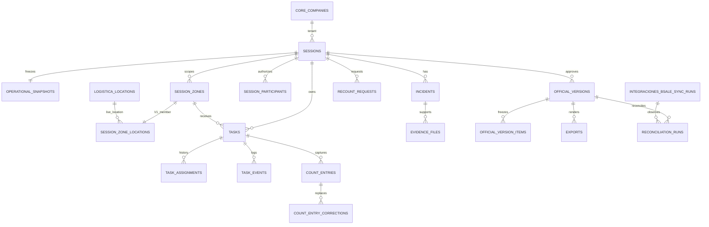

# Modelo de Datos Fisico - Inventory Engine

## 1. Objetivo y alcance

Esta especificacion traduce el modelo aprobado a objetos PostgreSQL/Supabase implementables en el esquema compartido `inventarios`. Define tablas, columnas, tipos, integridad, concurrencia, RLS conceptual, RPC, triggers, vistas y secuencia de migraciones. No incluye SQL ejecutable, migraciones, buckets, politicas ni codigo.

`inventarios` es propietario solo de datos del proceso. Consume maestros mediante referencias: no replica productos, usuarios, empresas, bodegas ni ubicaciones. Bsale sigue siendo fuente externa de stock; una version oficial de PetGrup es fuente interna del resultado aprobado.

## 2. Convenciones verificadas del repositorio

| Aspecto | Convencion aplicable | Evidencia |
| --- | --- | --- |
| PK | `uuid`, `PRIMARY KEY`, `DEFAULT gen_random_uuid()` | `20260616120000_multi_company.sql:10-11`; `20260618102400_create_logistics_module.sql:30-32` |
| Fechas | `timestamptz`, normalmente `NOT NULL DEFAULT now()` | `20260618102400_create_logistics_module.sql:42-45` |
| Estados | `text` o `varchar` con `CHECK`; no hay `CREATE TYPE` en los modulos revisados | `20260707173500_create_integraciones_sync_core.sql:24-27` |
| Tenant | `company_id uuid NOT NULL REFERENCES core.companies(id)` | `20260618102400_create_logistics_module.sql:32,52` |
| Usuario | `portal.users.id uuid`, FK a `auth.users`; auditoria por `created_by`, `updated_by` | `20250604000003_create_table_users.sql:1-20` |
| Empresa | `core.companies.id uuid` | `20260616120000_multi_company.sql:10-24` |
| RLS | `core.has_company_access(auth.uid(), company_id)` y permisos `portal.has_permission` | `20260616120000_multi_company.sql:199-211` |
| Auditoria global | `portal.audit_logs`, trigger `portal.audit_trigger()` | `20250604000014_evolve_audit_logs.sql:34-72` |
| Operaciones atomicas | RPC `SECURITY DEFINER` con validacion de empresa y `search_path` fijado | `20260620120700_reception_professional_fields.sql:76-93` |

Todas las tablas propias incluyen `id uuid`, `company_id uuid`, `created_at timestamptz` y `created_by uuid` salvo proyecciones estrictamente derivadas. Las entidades mutables incluyen `updated_at` y `updated_by`. El diseno usa FK compuestas internas `(company_id, id)` para hijos; las referencias externas usan FK simple cuando la tabla externa no expone una clave unica compuesta y se validan dentro de RPC/triggers de integridad.

## 3. Propiedad y referencias externas

| Entidad de Inventarios | Entidad externa real | FK o validacion | Uso | Escritura externa |
| --- | --- | --- | --- | --- |
| `sessions.company_id` | `core.companies.id` | FK simple | Tenant raiz | No |
| actores | `portal.users.id` | FK simple | creador, participante, supervisor, aprobador | No |
| producto vivo | `adquisiciones.products.id` | FK simple nullable en snapshots; validar empresa/global en RPC | catalogo y mapeo Bsale | No |
| bodega | `adquisiciones.warehouses.id` | FK simple; validar misma empresa | alcance oficial | No |
| ubicacion | `logistica.locations.id` | FK simple; validar empresa y bodega | maestro vivo de zona V1 | No |
| costo Bsale | `integraciones.bsale_reception_details` / `bsale_receptions` | referencias logicas por IDs Bsale; sin FK externa disponible entre ambas | costo historico snapshot | No |
| sync Bsale | `integraciones.bsale_sync_runs.id` | FK simple + misma empresa por RPC | snapshot y conciliacion | No |
| stock Bsale | `integraciones.bsale_stock_current` | lectura por empresa, variante y oficina; no FK por espejo mutable | snapshot/conciliacion | No |

Las tablas reales Bsale son plurales: `bsale_variants`, `bsale_receptions`, `bsale_reception_details`, `bsale_variant_costs`, `bsale_sync_runs` y `bsale_stock_current` (`20260703200000_bsale_integration_v1.sql:139-200,315-389`). Sus relaciones `variant_id` y `bsale_reception_id` son logicas, no FKs. `adquisiciones.products.company_id` puede ser nulo por catalogo global; la validacion acepta producto de la empresa o global (`20260617134500_global_catalog_and_suppliers.sql:3-28`).

## 4. Enums y catalogos

Usar `text` con `CHECK` para estados estables, siguiendo el repositorio. No crear enums PostgreSQL: cambian mediante migracion y el proyecto prefiere checks.

| Campo | Valores cerrados | Justificacion |
| --- | --- | --- |
| `sessions.status` | `DRAFT`, `PREPARED`, `COUNTING`, `UNDER_REVIEW`, `APPROVED`, `EXPORTED`, `RECONCILED`, `CANCELLED` | Ciclo oficial estable. |
| `sessions.inventory_type` | `GENERAL`, `PARTIAL`, `CYCLIC`, `CONTROL`, `RECOUNT` | Tipos aprobados; V1 habilita GENERAL/PARTIAL. |
| `tasks.status` | `ASSIGNED`, `IN_PROGRESS`, `PAUSED`, `COMPLETED` | Unicos estados persistentes permitidos. |
| `task_events.event_type` | `STARTED`, `RESUMED`, `REOPENED`, `REASSIGNED`, `VALIDATED`, `INVALIDATED`, `CANCELLED`, `PAUSED`, `COMPLETED` | Hechos auditables, no estados. |
| `count_entries.source` | `ANDROID`, `WEB` | Origen tecnico cerrado. |
| condiciones | `AVAILABLE`, `DAMAGED`, `EXPIRED`, `BLOCKED`, `OTHER_UNAVAILABLE` | Mutuamente excluyentes por unidad. |
| incidencias | severidad `INFORMATIONAL`, `OPERATIONAL`, `CRITICAL`, `BLOCKING`; estado `OPEN`, `UNDER_REVIEW`, `RESOLVED`, `CLOSED` | Clasificacion funcional estable. |
| export/archivo | formato `XLSX`, `CSV`, `PDF`; estado `REQUESTED`, `GENERATING`, `GENERATED`, `FAILED`, `SUPERSEDED` | Salidas tecnicas controladas. |
| evidencia | MIME permitido por CHECK/validacion: JPEG, PNG, WebP, PDF; sync `PENDING`, `SYNCED`, `FAILED`, `INVALIDATED` | Seguridad de archivos. |

Categorias de incidencia, reglas congeladas y tipos de exportacion complementarios no deben rigidizarse en enum. Usar catalogos propios de `inventarios` solo si requieren configuracion por empresa; mientras tanto, una clave textual validada por servicio y congelada en snapshot es suficiente.

## 5. Catalogo fisico de tablas

### 5.1 Jornada, alcance y zonas

**`inventarios.sessions`**. Propietario: Inventory Session. Escritura solo por RPC.

| Columna | Tipo PostgreSQL | Nulo | Default | FK/Regla | Proposito |
| --- | --- | --- | --- | --- | --- |
| `id`, `company_id` | `uuid` | no | UUID / ninguno | PK; FK `core.companies` | identidad y tenant |
| `session_number` | `integer` | no | ninguno | unico por empresa | correlativo visible |
| `inventory_type`, `status` | `text` | no | ninguno | CHECK oficiales | tipo y ciclo |
| `warehouse_id` | `uuid` | no | ninguno | FK `adquisiciones.warehouses`; misma empresa | bodega oficial |
| `bsale_office_id` | `integer` | no | ninguno | oficina Bsale configurada | alcance Bsale |
| `name`, `scope_mode`, `notes` | `text` | si/ no / si | ninguno | `scope_mode` GENERAL/PARTIAL | descripcion y alcance |
| `responsible_user_id`, `original_session_id` | `uuid` | no/si | ninguno | FK `portal.users`; autoreferencia sin cascade | responsable y rectificacion |
| `prepared_at`, `started_at`, `reviewed_at`, `approved_at`, `exported_at`, `reconciled_at`, `cancelled_at` | `timestamptz` | si | ninguno | coherentes con estado | hitos |
| `approved_by`, `cancelled_by`, `cancellation_reason` | `uuid`, `uuid`, `text` | si | ninguno | usuarios y motivo obligatorio al cancelar | control |
| auditoria | `timestamptz`, `uuid` | no | `now()` | FKs usuario cuando aplica | trazabilidad |

PK `id`; UNIQUE `(company_id, id)` y `(company_id, session_number)`. CHECK de fechas/actor por estado, rectificacion solo desde jornada aprobada, y cancelacion solo anterior a `APPROVED`. Indices: `(company_id,status,created_at DESC)`, `(company_id,warehouse_id,status)`, `(company_id,original_session_id)`. No hay DELETE; `status` controla cancelacion.

**`inventarios.session_product_scopes`**. Solo contiene inclusiones/exclusiones explicitas de PARTIAL; GENERAL se representa por regla congelada, no por miles de filas.

| Columna | Tipo PostgreSQL | Nulo | Default | FK/Regla | Proposito |
| --- | --- | --- | --- | --- | --- |
| `id`, `company_id`, `session_id` | `uuid` | no | UUID | PK; FK compuesta a session | pertenencia |
| `product_id`, `bsale_variant_id` | `uuid`, `integer` | si/no | ninguno | producto vivo opcional; variante requerida | selector estable |
| `inclusion_type`, `reason` | `text`, `text` | no/si | `INCLUDED` | CHECK INCLUDED/EXCLUDED | alcance parcial |
| auditoria | estandar | no | `now()` | actor | historia |

UNIQUE `(company_id,session_id,bsale_variant_id)`; indice `(company_id,session_id,inclusion_type)`. Editable solo en DRAFT. Validar producto de empresa o global y correspondencia de variante en RPC.

**`inventarios.session_zones`**. Zona operacional propia de una jornada, no maestro de ubicaciones.

| Columna | Tipo PostgreSQL | Nulo | Default | FK/Regla | Proposito |
| --- | --- | --- | --- | --- | --- |
| `id`, `company_id`, `session_id` | `uuid` | no | UUID | PK; FK compuesta a session | identidad |
| `zone_code`, `scan_code` | `text` | no | ninguno | unico por sesion | identificacion operacional/futuro escaneo |
| `display_name`, `priority`, `is_enabled` | `text`, `integer`, `boolean` | no/no/no | `0`, `true` | prioridad no negativa | operacion |
| auditoria | estandar | no | `now()` | actor | historia |

UNIQUE `(company_id,session_id,zone_code)` y `(company_id,session_id,scan_code)`. No usar `layout_group`.

**`inventarios.session_zone_locations`**. La membresia existe desde V1 para preparar agrupaciones futuras sin migrar la relacion basica.

| Columna | Tipo PostgreSQL | Nulo | Default | FK/Regla | Proposito |
| --- | --- | --- | --- | --- | --- |
| `id`, `company_id`, `session_zone_id` | `uuid` | no | UUID | PK; FK compuesta a session_zones | miembro de zona |
| `location_id` | `uuid` | no | ninguno | FK `logistica.locations`; misma empresa/bodega por RPC/trigger | ubicacion viva |
| `snapshot_location_id` | `uuid` | si | ninguno | FK compuesta interna posterior a snapshot | contexto congelado |
| auditoria | estandar | no | `now()` | actor | historia |

UNIQUE `(company_id,session_zone_id)` en V1 obliga exactamente una ubicacion por zona; UNIQUE `(company_id,session_id,location_id)` evita que una ubicacion pertenezca a dos zonas de la misma jornada. La segunda unica se logra incluyendo `session_id` como columna denormalizada validada contra la zona, para RLS y cardinalidad. En fase futura se elimina solo el primer UNIQUE y se conserva la prevencion de solapamiento. Indices por `(company_id,location_id)` y `(company_id,session_id)`.

### 5.2 Participantes, tareas y eventos

**`inventarios.session_participants`**.

| Columna | Tipo PostgreSQL | Nulo | Default | FK/Regla | Proposito |
| --- | --- | --- | --- | --- | --- |
| `id`, `company_id`, `session_id`, `user_id` | `uuid` | no | UUID | PK; FK session/portal.users | participacion |
| `functional_role` | `text` | no | ninguno | COUNTER/SUPERVISOR/ADMINISTRATOR/MANAGER | permiso de jornada |
| `active_from`, `revoked_at`, `revoked_by`, `revocation_reason` | tiempo/uuid/texto | si | ninguno | revocacion trazable | vigencia |
| auditoria | estandar | no | `now()` | actor | historia |

UNIQUE parcial de participante activo por `(company_id,session_id,user_id,functional_role)` donde `revoked_at IS NULL`; indice por usuario/jornada. RPC valida `core.user_company_access` activo y permisos `portal` antes de insertar.

**`inventarios.tasks`** y **`inventarios.task_assignments`**.

| Tabla / columna | Tipo PostgreSQL | Nulo | Default | FK/Regla | Proposito |
| --- | --- | --- | --- | --- | --- |
| `tasks.id, company_id, session_id, session_zone_id` | `uuid` | no | UUID | PK; FK compuesta internas | raiz tarea |
| `tasks.task_kind, status` | `text` | no | `PRIMARY`, `ASSIGNED` | PRIMARY/RECOUNT; cuatro estados | tipo/estado |
| `tasks.current_assignment_id` | `uuid` | si | ninguno | FK interna | responsable actual |
| `tasks.version`, `opened_at`, `completed_at` | `integer`, tiempo | no/si/si | `1` | version positiva | concurrencia/hitos |
| `tasks.validated_at, validated_by, invalidated_at` | tiempo/uuid | si | ninguno | evento vigente debe concordar | contribucion |
| `task_assignments.id, task_id, user_id` | `uuid` | no | UUID | PK; FK tarea/usuario | asignacion historica |
| `task_assignments.assigned_at, released_at, release_reason` | tiempo/texto | no/si/si | `now()` | una vigente | reasignacion |

UNIQUE parcial de tarea PRIMARY activa por `(company_id,session_id,session_zone_id)` donde no exista evento vigente CANCELLED/INVALIDATED; UNIQUE parcial de asignacion vigente por tarea. La restriccion de una zona abierta por usuario se aplica con indice unico parcial sobre asignacion/tarea `IN_PROGRESS` mediante columna proyectada `active_user_id` en `tasks`, mantenida exclusivamente por RPC; alternativa equivalente es trigger de integridad. No permitir UPDATE de una tarea `COMPLETED` salvo RPC de reapertura que incrementa `version`.

**`inventarios.task_events`**. Append-only.

| Columna | Tipo PostgreSQL | Nulo | Default | FK/Regla | Proposito |
| --- | --- | --- | --- | --- | --- |
| `id`, `company_id`, `session_id`, `task_id` | `uuid` | no | UUID | PK; FK compuestas | contexto |
| `event_type`, `previous_status`, `next_status` | `text` | no/si/si | ninguno | CHECK eventos; estados solo cuatro | transicion |
| `actor_id`, `occurred_at`, `reason` | uuid/tiempo/texto | no/no/si | `now()` | actor y motivo obligatorio para eventos sensibles | auditoria |
| `related_task_id`, `idempotency_key`, `technical_metadata` | uuid/uuid/jsonb | si/si/si | ninguno | FK interna; metadata variable | relacion/offline |

UNIQUE `(company_id,idempotency_key)` cuando exista; indices `(company_id,task_id,occurred_at DESC)` y `(company_id,session_id,event_type,occurred_at DESC)`. `REOPENED`, `REASSIGNED`, `VALIDATED`, `INVALIDATED`, `CANCELLED`, `STARTED` y `RESUMED` viven solo aqui.

### 5.3 Snapshot Operacional

**`inventarios.operational_snapshots`**, **`snapshot_products`**, **`snapshot_stocks`**, **`snapshot_costs`**, **`snapshot_locations`** y **`snapshot_configurations`**. Todo el agregado es insert-only y queda inmutable al completar su creacion.

| Tabla | Columnas tecnicas principales | Integridad / proposito |
| --- | --- | --- |
| `operational_snapshots` | `id uuid`, `company_id`, `session_id`, `bsale_sync_run_id uuid`, `captured_at timestamptz`, `captured_by uuid`, `content_hash char(64)`, `completion_status text` | UNIQUE `(company_id,session_id)`; FK session y `integraciones.bsale_sync_runs`; evidencia de corte. |
| `snapshot_products` | IDs, `snapshot_id`, `product_id uuid null`, `bsale_variant_id integer`, `sku text`, `barcode text`, `name text`, `product_payload jsonb` | UNIQUE `(company_id,snapshot_id,bsale_variant_id)`; copia historica y referencia viva opcional. |
| `snapshot_stocks` | IDs, `snapshot_id`, `bsale_variant_id integer`, `office_id integer`, `theoretical_quantity numeric(14,3)`, `source_sync_run_id uuid`, `source_synced_at timestamptz` | UNIQUE `(company_id,snapshot_id,bsale_variant_id,office_id)`; cantidad no negativa; stock Bsale congelado. |
| `snapshot_costs` | IDs, `snapshot_id`, `bsale_variant_id`, `sku`, `unit_cost numeric(14,2) null`, `source_type text`, `fallback_priority smallint`, IDs Bsale, fecha/documento, `cost_unavailable boolean`, `source_sync_run_id uuid` | UNIQUE `(company_id,snapshot_id,bsale_variant_id)`; costo nulo solo con `cost_unavailable`; nunca cero por ausencia. |
| `snapshot_locations` | IDs, `snapshot_id`, `location_id uuid`, `warehouse_id uuid`, `code`, `name`, `aisle`, `rack`, `level`, `position`, `is_active` | UNIQUE `(company_id,snapshot_id,location_id)`; copia estable de ubicacion V1. |
| `snapshot_configurations` | IDs, `snapshot_id`, `scope_rule jsonb`, `rules jsonb`, `provider_configuration jsonb`, `participant_context jsonb` | UNIQUE `(company_id,snapshot_id)`; JSONB solo para reglas/configuracion congelada variable. |

`snapshot_costs.source_type` admite `BSALE_RECEIPT`, `INTERNAL_RECEIPT_OR_KARDEX`, `BSALE_AVERAGE`, `SUPPLIER_MAPPING`, `UNAVAILABLE`. Para primaria conserva detalle Bsale, recepcion Bsale, fecha, documento, variante, SKU y sync; las referencias Bsale son logicas y deben validarse por empresa y antes de `captured_at` en RPC. Indices: cada UNIQUE anterior, `(company_id,snapshot_id,sku)` y `(company_id,snapshot_id,office_id,bsale_variant_id)`.

### 5.4 Conteos, incidencias, evidencias y reconteos

**`inventarios.count_entries`** y **`inventarios.count_entry_corrections`**. Elegir correcciones como nuevas filas vinculadas al aporte original: preserva historia, admite offline y evita sobreescritura.

| Tabla / columna | Tipo PostgreSQL | Nulo | Default | FK/Regla | Proposito |
| --- | --- | --- | --- | --- | --- |
| `count_entries` contexto | uuid | no | UUID | session, task, zone, snapshot, producto snapshot por FK compuesta | aporte |
| `count_entries` producto/origen | `integer`, `text`, `uuid` | no/no/si | ninguno | variante, fuente, offline idempotency | identidad movil |
| cantidades | `numeric(14,3)` x 6 | no | `0` | CHECK no negativas y suma obligatoria | fisico/condiciones |
| captura | `timestamptz`, `uuid`, `text`, `uuid`, `timestamptz` | no/no/no/si/si | `now()` | usuario, dispositivo, offline ID, sincronizacion | evidencia |
| vigencia | `timestamptz`, `uuid` | si | ninguno | invalidacion logica | exclusiones |
| correccion | `id`, contexto, `original_entry_id`, `replacement_entry_id`, `reason`, actor/fecha | uuid/texto/tiempo | no | FK a entradas; no ciclos | enlaza reemplazo append-only |

UNIQUE `(company_id,offline_idempotency_key)` y, cuando aplique, `(company_id,task_id,offline_sequence)`; indice `(company_id,task_id,captured_at)` y `(company_id,snapshot_id,bsale_variant_id)`. CHECK: `physical_quantity = available_quantity + damaged_quantity + expired_quantity + blocked_quantity + other_unavailable_quantity`; ninguna cantidad negativa. El aporte original nunca se actualiza. Una correccion inserta un nuevo aporte y una fila de relacion; el original recibe solo marcas de vigencia mediante RPC.

**`inventarios.incidents`**, **`incident_resolutions`** y **`evidence_files`**.

| Tabla | Columnas tecnicas principales | Integridad / proposito |
| --- | --- | --- |
| `incidents` | IDs y contexto de session/zone/task/count/product snapshot, `category text`, `severity text`, `status text`, `affected_quantity numeric(14,3) null`, `description text`, `is_blocking boolean`, actor/fechas | CHECK cantidad no negativa; CRITICAL bloquea aprobacion; FK de contexto opcional pero exige al menos zona, tarea, conteo o producto. |
| `incident_resolutions` | IDs, `incident_id`, `resolution text`, `resolved_by`, `resolved_at`, `metadata jsonb` | append-only; una resolucion vigente por incidencia mediante UNIQUE parcial. |
| `evidence_files` | IDs, session, incidente/tarea/conteo opcional, `storage_bucket text`, `storage_path text`, `original_name text`, `mime_type text`, `file_size_bytes bigint`, `sha256 char(64)`, captor/cargador/fechas, `device_id`, `offline_idempotency_key uuid`, `sync_status`, `invalidated_at/by/reason` | CHECK MIME, 20 MB, hash, exactamente un contexto; UNIQUE path y offline key por empresa; metadata sin URL firmada. |

Bucket futuro fijo: `inventory-evidence`, privado. Ruta: `<company_id>/sessions/<session_id>/incidents/<incident_id>/<evidence_id>/<sha256>.<ext>`; tareas y conteos sustituyen el segmento de incidencia. No hay DELETE fisico desde clientes; invalidacion conserva objeto y metadata. Indices: incidencias abiertas por `(company_id,session_id,severity,status)`, evidencias por `(company_id,session_id)` y por cada FK contextual.

**`inventarios.recount_requests`** y **`recount_decisions`**.

| Tabla | Columnas tecnicas principales | Integridad / proposito |
| --- | --- | --- |
| `recount_requests` | IDs de session/zone/product snapshot/task origen, `ordinal integer`, motivo, solicitante, tarea de reconteo, asignado, solicitado/finalizado | UNIQUE `(company_id,session_id,session_zone_id,snapshot_product_id,ordinal)`; ordinal positivo, sin limite maximo. |
| `recount_decisions` | IDs de solicitud, `selected_count_entry_id`, supervisor, fecha, justificacion, `confidence_score numeric(5,2) null` | UNIQUE `(company_id,recount_request_id)`; confianza derivada, nunca promedio oficial. |

Las tareas de reconteo usan `tasks.task_kind = RECOUNT`, son ciegas y se crean atomica y separadamente de la tarea origen.

### 5.5 Consolidacion, versiones, exportacion y conciliacion

**`inventarios.consolidation_runs`** y **`consolidation_results`** son caches auditables, no fuente manual de verdad.

| Tabla | Columnas tecnicas principales | Integridad / proposito |
| --- | --- | --- |
| `consolidation_runs` | IDs, session, snapshot, `run_type`, ejecutor/fecha, `input_hash`, `status` | registra calculo PRELIMINARY/VALIDATED; solo VALIDATED usa tareas con evento VALIDATED vigente. |
| `consolidation_results` | run, producto snapshot, zona opcional, condiciones, cantidades teorica/fisica/diferencia, selected count/recount decision | UNIQUE por run/producto/zona; cantidades derivadas, no editables; indice de diferencias. |
| `valuation_results` | run, producto snapshot, costo snapshot, faltante/sobrante/danado/vencido/bloqueado e impacto | usa exclusivamente `snapshot_costs`; costo nulo produce valorizacion nula y bandera. |

Los resultados validos pueden recalcularse desde hechos. Al aprobar, sus valores se copian a la version oficial; no se trata una vista temporal como fuente oficial.

**`inventarios.official_versions`** y **`official_version_items`**.

| Tabla | Columnas tecnicas principales | Integridad / proposito |
| --- | --- | --- |
| `official_versions` | IDs, session, `version_number integer`, `original_version_id uuid null`, `source_consolidation_run_id`, aprobador/fecha, `content_hash char(64)`, resumen JSONB, rectification_reason | UNIQUE `(company_id,session_id,version_number)`; una version aprobada por sesion; sin UPDATE/DELETE. |
| `official_version_items` | version, producto snapshot, variante/SKU, stock teorico/fisico, condiciones, diferencia, costo snapshot, fuente costo, valores economicos | UNIQUE `(company_id,official_version_id,snapshot_product_id)`; copia inmutable del resultado. |

Una rectificacion crea una nueva `sessions` vinculada por `original_session_id`; no altera jornada ni version original. Indices: version por sesion/fecha y detalle por variante/SKU.

**`inventarios.exports`** y **`export_downloads`**.

| Tabla | Columnas tecnicas principales | Integridad / proposito |
| --- | --- | --- |
| `exports` | version oficial, `export_kind`, formato, template_version, status, archivo bucket/path, `content_hash`, row_count, control_totals JSONB, solicitante/generador/fechas, `supersedes_export_id` | FK version; solo versiones oficiales; regeneracion es nueva fila; una exportacion oficial por clase/version mediante UNIQUE parcial. |
| `export_downloads` | export, usuario, fecha, IP/agent metadata | append-only; descargas no crean version. |

**`inventarios.reconciliation_runs`** y **`reconciliation_items`**.

| Tabla | Columnas tecnicas principales | Integridad / proposito |
| --- | --- | --- |
| `reconciliation_runs` | version, export usado, `bsale_sync_run_id uuid`, `office_id integer`, confirmacion importacion, actor/fechas, estado, cierre/autorizador | FK version/export/`integraciones.bsale_sync_runs`; misma empresa validada por RPC. |
| `reconciliation_items` | run, `variant_id integer`, `office_id integer`, stock aprobado/observado, diferencia, coincide, justificacion, decision | UNIQUE `(company_id,reconciliation_run_id,variant_id,office_id)`; copia inmutable del espejo mutable. |

La RPC exige sync posterior a importacion, `COMPLETED`, terminado, sin error y que cada fila `integraciones.bsale_stock_current` observada tenga ese `bsale_sync_run_id`. La clave de comparacion es `company_id + variant_id + office_id`, nunca solo SKU.

**`inventarios.audit_events`**. Conserva auditoria funcional append-only: session, entidad, entidad ID, tipo de evento, actor, fecha, origen, correlation ID, idempotency key, motivo y metadata. No sustituye `portal.audit_logs`: este ultimo registra auditoria transversal tecnica; el primero conserva semantica de negocio y eventos offline. Indices `(company_id,session_id,occurred_at DESC)` y `(company_id,entity_type,entity_id,occurred_at DESC)`.

## 6. Constraints e integridad

- Todas las tablas hijas propias declaran UNIQUE `(company_id,id)` en padres y FK compuestas `(company_id,parent_id)`; evita cruces de tenant dentro de `inventarios`.
- Referencias a maestros externos se validan por FK simple y RPC/trigger de integridad porque no todas exponen clave unica compuesta. Validar empresa de bodega, ubicacion, sync y usuario; producto debe ser de empresa o global.
- No usar `ON DELETE CASCADE` en snapshots, conteos, eventos, versiones, evidencias, exportaciones o conciliaciones. Usar `RESTRICT` para relaciones requeridas e historial/autorizacion para cancelaciones.
- CHECK de cantidades, fechas de estado, costo nulo controlado, hashes de 64 caracteres, tamanos de archivo y MIME. `numeric(14,3)` para cantidades; `numeric(14,2)` para costo/valores monetarios, acorde a integraciones.
- UNIQUE parcial: tarea PRIMARY activa por zona; usuario con una tarea IN_PROGRESS; participante vigente; asignacion vigente; offline idempotency; version oficial; exportacion oficial por tipo; resolucion vigente.
- La validez de consolidacion se determina por evento VALIDATED vigente y ausencia de INVALIDATED/CANCELLED posterior; no por una bandera manual editable.

## 7. Indices

| Tabla | Indice propuesto | Tipo | Proposito |
| --- | --- | --- | --- |
| `sessions` | `(company_id,status,created_at DESC)` | btree | dashboard y RLS |
| `session_zone_locations` | `(company_id,session_zone_id)` | unique btree | V1 una ubicacion/zona |
| `session_zone_locations` | `(company_id,session_id,location_id)` | unique btree | evitar solapamiento de ubicacion |
| `session_participants` | `(company_id,user_id,session_id)` parcial activo | btree | tareas moviles |
| `tasks` | `(company_id,current_assignment_id,status)` | btree | tareas del contador |
| `task_events` | `(company_id,task_id,occurred_at DESC)` | btree | historia |
| `count_entries` | `(company_id,task_id,captured_at)` | btree | sincronizacion y consolidacion |
| `count_entries` | `(company_id,snapshot_id,bsale_variant_id)` | btree | consolidacion por SKU |
| `incidents` | `(company_id,session_id,severity,status)` | btree | bloqueos/aprobacion |
| `evidence_files` | `(company_id,session_id)` | btree | evidencia jornada |
| `snapshot_stocks` | `(company_id,snapshot_id,bsale_variant_id,office_id)` | unique btree | corte Bsale |
| `official_version_items` | `(company_id,official_version_id,bsale_variant_id)` | btree | exportacion |
| `reconciliation_items` | `(company_id,reconciliation_run_id,variant_id,office_id)` | unique btree | comparacion Bsale |
| `audit_events` | `(company_id,session_id,occurred_at DESC)` | btree | auditoria |

## 8. Concurrencia y transacciones

| Operacion | Agregado bloqueado / precondiciones | Estrategia y RPC |
| --- | --- | --- |
| Preparar jornada | session DRAFT, alcance coherente | `prepare_session`; transaccion y validacion de maestros |
| Iniciar y snapshot | session PREPARED, zonas/participantes, sync Bsale valido | `start_session`; bloqueo de session, insercion atomica de snapshot y cambio COUNTING |
| Abrir/pausar/completar tarea | task asignada al actor, version esperada | RPC con `FOR UPDATE`, version optimista y evento append-only |
| Reasignar/reabrir | supervisor, tarea valida, motivo | RPC bloquea task/zona; crea asignacion/evento; reapertura retira validacion vigente |
| Registrar conteo | tarea IN_PROGRESS, actor asignado, offline key nueva | `record_count_entry`; idempotencia UNIQUE, valida condiciones y agrega evento |
| Corregir conteo | entrada vigente y tarea abierta/reabierta | `correct_count_entry`; nueva entrada + relacion, nunca UPDATE destructivo |
| Validar tarea | task COMPLETED, supervisor, sin pendientes | `validate_task`; bloquea task, inserta evento y recalcula consolidacion validada |
| Reconteo/decision | supervisor, alcance valido | crear solicitud+tarea; decision bloquea solicitud y recalcula resultado |
| Revision/aprobacion | todas tareas validadas, sin bloqueos | `approve_session`; bloquea session, recalcula, crea version/hash en una transaccion |
| Exportar | version oficial inmutable | `request_export`; crea solicitud idempotente, generacion asincrona solo escribe export propio |
| Conciliar/cerrar | export oficial, sync Bsale valido | `run_reconciliation` y `close_reconciliation`; bloquea run, copia stock observado, no reconsulta para cierre |

Las transiciones, consolidacion, aprobacion y conciliacion requieren RPC `SECURITY DEFINER` con `search_path` fijo, `auth.uid()`, acceso de empresa y permisos comprobados. No confiar en frontend ni permitir UPDATE directo de agregados inmutables.

## 9. RLS conceptual

Roles funcionales se mapean a permisos existentes de `portal`; el repositorio tiene roles como `SUPER_USUARIO`, `GERENCIA`, `BODEGA` y permisos por modulo, pero no permisos de Inventarios aun (`src/app/actions/roles.ts:18-19`). Deben crearse permisos de Inventarios en su migracion de seguridad futura.

| Entidad | Contador | Supervisor | Administrador | Gerencia | Service role |
| --- | --- | --- | --- | --- | --- |
| sessions/snapshot | SELECT de jornada asignada sin costos | SELECT completo | CRUD por RPC | SELECT resultados autorizados | mantenimiento controlado |
| zones/tasks/events | SELECT/UPDATE solo tarea asignada por RPC | SELECT/operacion por RPC de su empresa | todo por RPC | SELECT limitado | controlado |
| count entries | INSERT propio y SELECT propio; sin costos | SELECT/validar por RPC | SELECT por RPC | no directo | controlado |
| incidents/evidence | INSERT/SELECT de contexto asignado | resolver/ver por RPC | todo por RPC | SELECT autorizado | controlado |
| consolidation/valuation | sin acceso a costos/diferencias | SELECT y decisiones por RPC | aprobar por RPC | SELECT autorizado | controlado |
| versions/exports/reconciliation | sin acceso | lectura limitada | crear/confirmar por RPC | lectura/aprobacion si permiso | controlado |
| audit events | solo sin acceso directo | lectura autorizada | lectura autorizada | lectura autorizada | controlado |

Todas las politicas SELECT filtran `core.has_company_access(auth.uid(), company_id)`. Las mutaciones de negocio se niegan por tabla a `authenticated` y se exponen mediante RPC autorizadas. Storage requiere politicas separadas por empresa, jornada y evidencia; sus objetos no son accesibles por URL publica.

## 10. Funciones y RPC requeridas

| Funcion/RPC | Responsabilidad | Actor | Tablas afectadas | Transaccion |
| --- | --- | --- | --- | --- |
| `prepare_inventory_session` | alcance, zonas y participantes | administrador | sessions, scopes, zones, participants | si |
| `start_inventory_session` | snapshot y apertura | administrador | session, snapshot* | si |
| `open_inventory_task` | apertura exclusiva | contador | tasks, events | si |
| `record_inventory_count` | aporte idempotente | contador | counts, events | si |
| `correct_inventory_count` | reemplazo trazable | contador/supervisor | counts, corrections, events | si |
| `complete_inventory_task` | cierre preliminar | contador | tasks, events | si |
| `validate_inventory_task` | incluir en consolidado | supervisor | tasks, events, consolidation* | si |
| `reopen_inventory_task` / `reassign_inventory_task` | excepciones operativas | supervisor | tasks, assignments, events | si |
| `create_inventory_recount` / `decide_inventory_recount` | reconteo ciego/decision | supervisor | recount*, tasks, events | si |
| `move_inventory_session_to_review` | cierre operativo | supervisor | sessions, events | si |
| `approve_inventory_session` | version oficial y hash | aprobador | session, consolidation*, versions* | si |
| `request_inventory_export` | salida versionada | administrador | exports, audit | si |
| `record_bsale_import` | confirmacion declarada de carga | administrador | exports, reconciliation | si |
| `run_inventory_reconciliation` / `close_inventory_reconciliation` | copia y cierre Bsale | administrador | reconciliation*, session | si |

`*` significa tablas del agregado indicado. No se escriben implementaciones en esta especificacion.

## 11. Triggers requeridos

- `set_updated_at` para entidades editables; `updated_by` se define desde RPC, no desde trigger.
- Triggers de inmutabilidad que rechacen UPDATE/DELETE en snapshot*, task_events, count_entries originales, corrections, evidence_files confirmados, official_versions/items y reconciliation_items cerrados.
- Trigger de integridad empresarial para referencias externas simples: bodega/ubicacion/sync/usuario y producto propio/global.
- Trigger de auditoria tecnica a `portal.audit_logs` para cabeceras mutables, complementado por `inventarios.audit_events` para hechos funcionales.
- No usar triggers para transiciones complejas, calculo de consolidacion, aprobacion o conciliacion; esos flujos pertenecen a RPC explicitas.

## 12. Vistas y proyecciones

| Vista/proyeccion | Fuente | Materializacion futura |
| --- | --- | --- |
| `v_session_dashboard` | sessions, tareas, incidencias, versiones | no inicialmente |
| `v_zone_progress` | zones, tasks, events, counts | si para jornadas grandes |
| `v_current_tasks` | tasks + asignacion vigente | no |
| `v_preliminary_counts` | conteos vigentes | no |
| `v_validated_consolidation` | tasks con VALIDATED + conteos/reconteos | si por volumen |
| `v_inventory_differences` | snapshot stock + consolidado validado | si |
| `v_uncounted_products` | snapshot products menos conteos validados | no |
| `v_open_incidents` | incidents/resolutions | no |
| `v_pending_recounts` | recount requests/decisions | no |
| `v_inventory_valuation` | consolidado + snapshot costs | si |
| `v_official_version_summary` | versions/items | no |
| `v_reconciliation_status` | reconciliation runs/items | no |
| `v_management_kpis` | proyecciones anteriores | si segun volumen |

## 13. Matriz de mutabilidad fisica

| Tabla | INSERT | UPDATE | DELETE | Inmutable desde | Escritura mediante |
| --- | --- | --- | --- | --- | --- |
| sessions | RPC | hasta APPROVED | no | APPROVED | RPC |
| scope/zones/participants | RPC | hasta snapshot o revocacion | no | snapshot/revocacion | RPC |
| snapshots y componentes | RPC | no | no | insercion completa | RPC |
| tasks/asignaciones | RPC | transiciones autorizadas | no | COMPLETED salvo REOPENED | RPC |
| task_events/counts/corrections | RPC | no | no | insercion | RPC |
| incidents/resolutions | RPC | estado autorizado / no | no | CLOSED / insercion | RPC |
| evidence_files | RPC | solo estado tecnico/invalidation | no | SYNCED | RPC |
| consolidation caches | RPC/servicio | regenerable | no | version oficial | servicio |
| official_versions/items | RPC | no | no | insercion | RPC |
| exports/downloads/reconciliation/audit | RPC/servicio | solo estados no cerrados | no | cierre/insercion | RPC/servicio |

## 14. Diagrama fisico

## 15. Plan de migraciones

1. Crear esquema `inventarios`, grants minimos, checks y convenciones compartidas.
2. Crear sesiones, alcance, zonas V1, participantes y constraints multiempresa.
3. Crear Snapshot Operacional y validacion de referencias externas.
4. Crear tareas, asignaciones, eventos, conteos y correcciones idempotentes.
5. Crear incidencias, evidencias y reconteos.
6. Crear consolidacion, valorizacion, versiones oficiales y hashes.
7. Crear exportaciones, conciliaciones y auditoria funcional.
8. Crear RPC, triggers de inmutabilidad/integridad, RLS y grants.
9. Crear vistas, indices finales y validaciones de rendimiento.

Cada migracion futura debe mantenerse bajo 500 lineas y desplegarse en orden; primero estructuras y constraints, despues RPC/RLS, finalmente vistas e indices no esenciales.

## 16. Riesgos tecnicos

| Riesgo | Mitigacion |
| --- | --- |
| Relaciones Bsale sin FK real | Validar por empresa/ID en RPC y congelar evidencia de origen. |
| Referencias externas sin clave compuesta tenant | FKs simples mas trigger/RPC de misma empresa; FKs compuestas dentro de `inventarios`. |
| `bsale_stock_current` mutable | Copiar stock observado a `reconciliation_items`. |
| Producto global sin `company_id` | Validacion explicita de producto global o de la empresa. |
| Conteos offline duplicados o fuera de orden | idempotency key, secuencia, timestamps de captura/sync y RPC atomica. |
| Volumen de conteos/auditoria | indices definidos y materializacion selectiva de proyecciones. |
| Costo Bsale sin semantica tributaria probada | Etiquetar como costo unitario historico informado por Bsale; no tratarlo como costo neto contable. |
| Rol funcional no mapeado a permiso tecnico | Crear permisos de Inventarios antes de habilitar RLS mutante. |
| Evidencia historica eliminada | bucket privado dedicado, sin DELETE de cliente e invalidacion logica. |

## 17. Veredicto

El diseno fisico esta listo para crear migraciones del esquema `inventarios`. No existen bloqueadores de modelado. Permanecen validaciones runtime no bloqueantes: semantica tributaria exacta de `bsale_reception_details.cost`, datos/migraciones efectivamente aplicados, prueba de conciliacion real posterior a importacion Bsale y politica definitiva de capacidad/retencion de evidencia.

La especificacion confirma: base compartida, esquema exacto `inventarios`, maestros externos no duplicados, `logistica.locations` como maestro vivo, una ubicacion por zona V1, cuatro estados persistentes de tarea, eventos separados, consolidacion solo validada, costos nulos controlados, versiones inmutables, rectificaciones vinculadas, exportaciones desde versiones, conciliacion contra `integraciones.bsale_sync_runs` y evidencia privada/idempotente sin eliminacion fisica.
