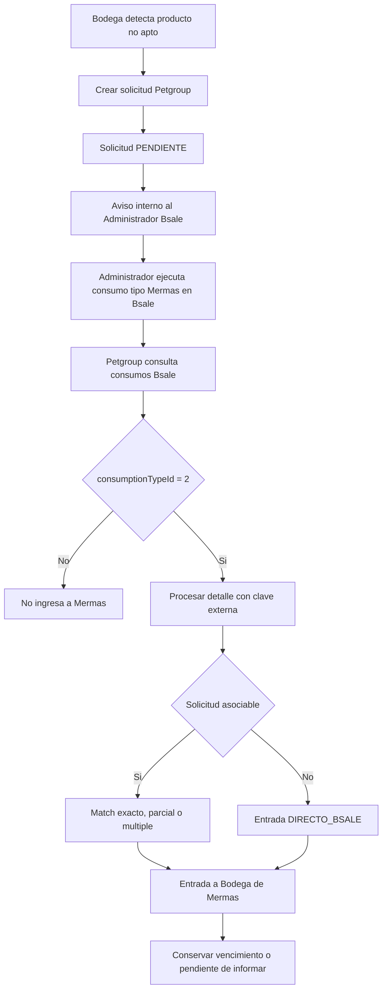
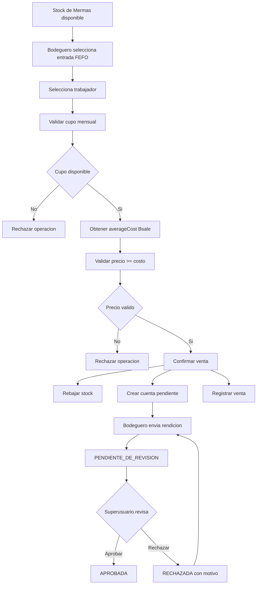

# Documento Funcional Maestro de Mermas

**Producto:** Petgroup ERP  
**Dominio:** Bodega / Logistica  
**Estado:** Fuente funcional de verdad  
**Version:** 1.0 funcional  
**Alcance:** Definicion funcional. No define tablas, migraciones, RPC ni frontend.

## 1. Proposito y alcance

El modulo de **Mermas** formaliza, controla y audita los productos que salen del stock comercial de Bsale mediante un consumo Bsale del tipo **Mermas**.

El modulo debe controlar posteriormente:

- Solicitudes operacionales.
- Confirmacion del movimiento real en Bsale.
- Matching entre solicitudes y consumos Bsale.
- Bodega interna de Mermas.
- Lotes y fechas de vencimiento.
- Venta interna a trabajadores.
- Reglas antifraude.
- Eliminacion de productos no recuperables.
- Cuentas pendientes por rendir.
- Rendicion, revision, aprobacion y rechazo.
- Trazabilidad, auditoria e indicadores.

El modulo pertenece funcionalmente a Bodega / Logistica. La arquitectura tecnica definitiva se definira en una fase posterior.

Quedan fuera de este documento la creacion de tablas fisicas, migraciones, RPC, frontend, maestro completo de RRHH, ventas tributarias, eliminaciones tecnicas y rendiciones implementadas.

## 2. Principios funcionales

1. Bsale es la fuente efectiva del movimiento que retira el producto del stock comercial.
2. Petgroup es la fuente operativa para solicitudes, matching, stock interno, ventas internas y rendiciones.
3. Una solicitud Petgroup nunca genera stock de Mermas por si sola.
4. Solo un consumo real Bsale de tipo Mermas puede generar una entrada Bsale a la Bodega de Mermas.
5. Los movimientos directos en Bsale se incorporan aunque no exista solicitud previa.
6. El stock es consecuencia de movimientos y no un valor editable arbitrariamente.
7. Toda operacion critica debe ser trazable y auditable.
8. La nota Bsale aporta contexto, pero no clasifica el movimiento.
9. El tipo Bsale es la clasificacion oficial.
10. No se importa automaticamente el historico anterior al hito de activacion.

## 3. Contrato Bsale cerrado

### 3.1 Recursos

Listado de consumos:

```text
GET /stocks/consumptions.json
```

Encabezado individual:

```text
GET /stocks/consumptions/{consumption_id}.json
```

Detalles:

```text
GET /stocks/consumptions/{consumption_id}/details.json
```

Tipos de consumo:

```text
GET /stock_consumption_types.json
```

La consulta de consumos entrega encabezados con referencia a detalles. Un encabezado puede tener multiples detalles y una misma variante puede aparecer repetida en diferentes lineas.

### 3.2 Tipos observados en MYM

| Etiqueta funcional | Identificador API | Codigo Bsale (referencia) | Resultado Petgroup |
|---|---:|---:|---|
| Retiro | 1 | 12 | No ingresar |
| Mermas | 2 | 13 | Ingresar |
| Robo | 3 | 14 | No ingresar |
| Destruccion | 4 | 15 | No ingresar |

La API devuelve para el tercer registro la clave `consumption_type.desmedro`, mientras la interfaz de Bsale observada muestra **Robo**. La etiqueta funcional del modulo se basa en la interfaz y en la posicion estable del catalogo, pero la integracion debe conservar el identificador API.

### 3.3 Regla de ingreso

La unica condicion operacional para que un consumo Bsale ingrese a la Bodega de Mermas Petgroup es:

```text
consumptionTypeId = 2
```

`cntCode = 13` se conserva unicamente como referencia informativa del catalogo Bsale. No participa en la deteccion runtime ni en la condicion de procesamiento.

Reglas:

- Retiro: no ingresar a Mermas.
- Mermas: ingresar a Mermas.
- Robo: no ingresar a Mermas.
- Destruccion: no ingresar a Mermas.

La nota Bsale no puede cambiar esta clasificacion. Puede contener motivo, comentarios, referencia de solicitud Petgroup o informacion adicional.

### 3.4 Campos funcionales disponibles

Encabezado:

- `id`: identificador externo del consumo.
- `consumptionDate`: fecha Bsale en epoch Unix.
- `note`: nota libre.
- `consumptionTypeId`: tipo oficial.
- `office.id`: sucursal u oficina.
- `user.id`: usuario Bsale que ejecuto el consumo.
- `details.href`: referencia al detalle.
- `updateStock`: valor entregado por Bsale; su semantica exacta debe validarse operativamente antes de usarlo como regla.
- `imagestionCcdescription`.
- `imagestionCenterCostId`.

Detalle:

- `id`: identificador externo del detalle.
- `quantity`: cantidad.
- `cost`: costo informado en la linea del consumo.
- `variantStock`: stock contextual informado por Bsale.
- `variant.id`: variante Bsale.

SKU, codigo de barras y descripcion se resuelven desde la variante Bsale. El costo promedio oficial se consulta separadamente.

### 3.5 Identidad externa e idempotencia

La unidad funcional de procesamiento es el detalle Bsale. La clave externa recomendada es:

```text
consumption_id + detail_id
```

Un mismo detalle Bsale nunca puede producir dos entradas de Mermas.

No son identificadores suficientes por si solos:

- Producto.
- SKU.
- Variante.
- Fecha.
- Cantidad.
- Nota.

La implementacion de la restriccion se definira tecnicamente en una fase posterior.

## 4. Hito de activacion

El modulo debe tener una fecha/hito formal de activacion.

No se importara automaticamente el historico completo de Mermas. Solo los consumos Bsale de tipo 2 posteriores al hito podran incorporarse al stock operacional de Mermas.

Los consumos anteriores podran consultarse o analizarse en el futuro, pero no forman parte del saldo inicial salvo decision posterior explicita y auditada.

La fecha de activacion debe ser visible e **inmutable en operacion normal**. No debe existir una edicion ordinaria desde configuracion. Una eventual correccion solo puede realizarse mediante un procedimiento excepcional, explicito y completamente auditado.

## 5. Solicitud operacional

### 5.1 Inicio normal

El flujo normal comienza en Petgroup cuando Bodega detecta un producto que debe salir del stock comercial por una causa justificable:

- Envase roto.
- Deterioro.
- Proximidad de vencimiento.
- Producto no apto para venta normal.
- Dano.
- Otra condicion operacional justificable.

Bodega crea una solicitud de Merma. La solicitud inicial queda en estado `PENDIENTE`.

### 5.2 Datos minimos por linea

Cada linea solicitada debe conservar conceptualmente:

- Producto.
- Variante Bsale.
- SKU.
- Cantidad.
- Motivo.
- Fecha de vencimiento.
- Lote, cuando este disponible.
- Solicitante.
- Fecha de solicitud.
- Observacion opcional.

La fecha de vencimiento es obligatoria para la gestion operacional de Mermas. El lote puede ser opcional inicialmente, pero el futuro modelo debe conservarlo cuando exista.

### 5.3 Correlativo

Cada solicitud debe tener una referencia unica, legible y humana. Ejemplo conceptual:

```text
MER-2026-000001
```

El formato final se definira tecnicamente. La referencia debe mostrarse al Administrador Bsale para facilitar su inclusion en la nota:

```text
MER-2026-000001 | SACO ROTO
```

La nota ayuda al matching, pero nunca es la unica condicion de asociacion.

## 6. Aviso interno

Al crear una solicitud:

- No se envia WhatsApp.
- No se envia correo.
- No se integra un servicio externo en V1.
- Se genera solamente un aviso interno en Petgroup.

El Administrador Bsale debe ver las solicitudes pendientes y un indicador de cantidad pendiente. El mecanismo tecnico de notificaciones queda para una fase posterior.

## 7. Ejecucion en Bsale

El Administrador Bsale ejecuta manualmente:

```text
Nuevo consumo
-> Tipo: Mermas
-> Productos y cantidades
-> Finalizar consumo
```

Petgroup no debe aumentar el stock de Mermas por la existencia de una solicitud. La entrada efectiva se produce solamente cuando Petgroup detecta el consumo Bsale real de tipo 2.

### 7.1 Regla operacional de agrupacion

En V1 rige la siguiente regla:

```text
1 solicitud Petgroup MER-... = 1 consumo Bsale tipo Mermas
```

Una solicitud puede contener multiples productos o lineas. El Administrador Bsale debe registrar todas esas lineas dentro de un unico consumo tipo Mermas y utilizar la referencia de la solicitud en la nota cuando el flujo haya comenzado en Petgroup.

No se deben mezclar en un mismo consumo Bsale productos correspondientes a solicitudes distintas, por ejemplo `MER-001`, `MER-002` y `MER-003`. Esta regla reduce la ambiguedad del matching.

La regla no afecta los movimientos directos realizados en Bsale. Un consumo tipo Mermas sin solicitud previa sigue siendo valido y debe ingresar como `DIRECTO_BSALE`.

## 8. Deteccion y matching

### 8.1 Deteccion

El criterio oficial de deteccion es:

```text
consumptionTypeId = 2
```

La nota no clasifica el movimiento. Un consumo tipo 2 debe procesarse aunque la nota este vacia, tenga otra redaccion o no mencione una solicitud.

### 8.2 Matching conceptual

Cuando exista una solicitud y aparezca el consumo Bsale correspondiente, Petgroup debe poder asociarlos considerando:

- Identificador `MER` en la nota, cuando exista.
- Variante.
- Cantidad.
- Fecha.
- Solicitud pendiente.
- Lineas del consumo.

No se define todavia el algoritmo de matching. El modelo funcional debe soportar:

- Cumplimiento exacto.
- Cumplimiento parcial.
- Varias salidas Bsale para una solicitud.
- Varias solicitudes del mismo producto.
- Movimiento superior a lo solicitado.
- Movimiento Bsale sin solicitud.

La regla `1 solicitud MER = 1 consumo Bsale` no implica coincidencia automatica perfecta. Deben poder detectarse y conservarse para revision cantidades inferiores o superiores, lineas faltantes, productos adicionales y cualquier otra diferencia entre la solicitud y el consumo.

### 8.3 Estados de solicitud

Estados conceptuales minimos:

| Estado | Significado |
|---|---|
| `PENDIENTE` | Solicitud creada sin cumplimiento suficiente |
| `PARCIAL` | Parte de la solicitud fue asociada a consumos Bsale |
| `CUMPLIDA` | La solicitud fue cubierta funcionalmente |
| `CANCELADA` | La solicitud deja de requerir ejecucion |

No se agregan estados funcionales adicionales en esta fase.

## 9. Movimientos directos Bsale

Gerencia, Superusuario o un Administrador Bsale pueden ejecutar un consumo tipo Mermas sin solicitud previa.

Petgroup debe detectarlo, no rechazarlo ni ignorarlo.

Regla:

```text
consumptionTypeId = 2
sin solicitud Petgroup asociada
=> entrada directa a Mermas
```

La entrada debe conservar un origen funcional equivalente a:

```text
DIRECTO_BSALE
```

El movimiento directo no requiere crear una solicitud retroactiva para ingresar al stock. Si faltan datos operacionales, debe quedar pendiente de completar sin perder la entrada.

## 10. Vencimientos y lotes

### 10.1 Identidad de las entradas

El stock no puede administrarse solamente como `producto + cantidad`.

Ejemplo:

```text
Producto X
5 unidades -> vencimiento 2026-10-15
8 unidades -> vencimiento 2026-12-20
```

Estas entradas no deben reducirse funcionalmente a 13 unidades sin vencimiento.

Cada entrada debe conservar, cuando exista:

- Producto y variante.
- Cantidad.
- Fecha de vencimiento.
- Lote.
- `details[].cost`, como costo historico informado por la linea Bsale.
- `averageCost`, como costo promedio oficial de referencia para venta interna, cuando haya sido consultado.
- Referencia al consumo y detalle Bsale.
- Origen.

Una linea o partida operacional de Mermas representa una unica fecha de vencimiento. Por ejemplo:

```text
SKU X
5 unidades -> 2026-10-15
5 unidades -> 2026-12-20
```

deben representarse como dos partidas internas distintas. No puede existir una unica partida de 10 unidades con dos vencimientos.

Si una linea Bsale directa contiene unidades que fisicamente corresponden a distintos vencimientos, Petgroup debe poder desglosarla posteriormente en varias partidas internas sin duplicar la identidad externa:

```text
consumption_id + detail_id
```

La identidad Bsale corresponde a la linea externa. Las partidas de vencimiento corresponden a la distribucion operacional interna de esa linea. No se define todavia el algoritmo ni el modelo fisico de ese desglose.

### 10.2 Entrada directa sin vencimiento

Bsale no entrega fecha de vencimiento en el consumo. Si una entrada directa no tiene fecha:

- No se pierde.
- Se incorpora como entrada pendiente de completar.
- Debe mostrarse `Vencimiento pendiente de informar`.
- Debe completarse antes de considerarla completamente regularizada para gestion o venta interna.

### 10.3 FEFO

La regla operacional futura es **FEFO (First Expired, First Out)**.

Cuando existan varias entradas del mismo producto, debe priorizarse la fecha de vencimiento mas proxima para liquidacion o venta interna.

Debe existir soporte para alertas configurables de:

- Producto vencido.
- Proximo a vencer en 7 dias.
- Proximo a vencer en 15 dias.
- Proximo a vencer en 30 dias.
- Proximo a vencer en 60 dias.

Los umbrales deben ser configurables por Superusuario y no quedar hardcodeados.

## 11. Bodega interna de Mermas

La Bodega de Mermas es un stock interno operacional de Petgroup. No es una bodega Bsale.

Debe existir conceptualmente un ledger o kardex. El saldo es consecuencia de los movimientos:

```text
Entrada Bsale Merma +10
Venta interna       -2
Eliminacion         -3
Saldo                5
```

El saldo no puede editarse arbitrariamente.

Tipos funcionales iniciales:

- `ENTRADA_BSALE`.
- `VENTA_INTERNA`.
- `ELIMINACION`.
- `REVERSA_CORRECCION` formal, cuando corresponda.

No se permite borrar trazabilidad para corregir saldos.

## 12. Maestro simple de trabajadores

La venta interna requiere identificar al trabajador comprador.

No debe utilizarse `portal.users` como equivalente obligatorio a trabajador. Un trabajador puede no tener acceso al ERP.

V1 requiere conceptualmente un maestro simple con informacion minima para identificar a la persona, desacoplado del usuario ERP y preparado para futura integracion con RRHH.

No se define esquema fisico ni se crea el maestro en este bloque.

## 13. Venta interna

Una entrada de Merma fisicamente utilizable puede venderse a personal interno.

El bodeguero gestiona la operacion. Debe registrarse conceptualmente:

- Trabajador.
- Producto.
- Entrada o lote de Merma.
- Cantidad.
- Fecha.
- Costo promedio Bsale utilizado.
- Porcentaje o configuracion aplicada.
- Precio unitario.
- Monto total.
- Bodeguero responsable.

La venta interna es un cobro interno. No genera boleta, factura ni documento tributario Bsale.

## 14. Costo y precio

### 14.1 Costo oficial

El costo de referencia es el costo promedio oficial Bsale:

```text
GET /variants/{variant_id}/costs.json
```

Campo:

```text
averageCost
```

El campo `details[].cost` pertenece al movimiento y no debe utilizarse automaticamente como equivalente de `averageCost`.

### 14.2 Conservacion historica

Al confirmar una venta interna debe conservarse el costo promedio utilizado en ese momento, junto con:

- `averageCost` utilizado.
- Porcentaje aplicado.
- Precio calculado.

Un cambio posterior del costo Bsale no modifica ventas historicas.

### 14.3 Precio minimo

Debe existir una configuracion editable solo por Superusuario. Ejemplo:

```text
Recargo venta interna = 20 %
```

Regla invariable:

```text
Precio de venta interna >= costo promedio Bsale utilizado
```

La proteccion contra venta bajo costo es una invariante de negocio y no una preferencia configurable.

## 15. Control antifraude mensual

Debe existir un limite **global mensual por trabajador** para ventas internas.

Ejemplo:

```text
Limite mensual: 3 unidades
Compras en septiembre: 2 unidades
Cupo restante: 1 unidad
```

Caracteristicas:

- Global por trabajador.
- Por mes calendario.
- Configurable.
- Editable solo por Superusuario.
- Independiente del SKU.
- Independiente de familia, valor o producto.
- Se consume al confirmar la venta.
- No se consume al rendir el dinero.

El objetivo es evitar el incentivo:

```text
deteriorar producto -> enviarlo a Mermas -> comprarlo a precio reducido
```

Una anulacion o reversa futura solo puede devolver cupo mediante un proceso formal y auditable. No se borran ventas para recuperar cupo.

## 16. Efecto transaccional de la venta

Al confirmar correctamente una venta interna deben ocurrir funcionalmente de forma indivisible:

1. Rebaja del stock disponible de Mermas.
2. Registro de la venta interna.
3. Creacion de la cuenta pendiente por rendir a cargo del bodeguero.

No debe existir salida sin cuenta por rendir ni deuda sin salida de stock. La implementacion transaccional se definira posteriormente.

## 17. Cuenta pendiente por rendir

Ejemplo:

```text
Trabajador: Roberto
Cantidad: 1 saco
Monto: $39.000
Bodeguero responsable: Juan
```

Al confirmar:

```text
Stock Mermas -1
Juan queda con $39.000 pendientes por rendir
```

El stock no espera la rendicion. La cuenta permanece abierta hasta que la rendicion sea revisada y aprobada.

## 18. Rendicion del bodeguero

El bodeguero debe disponer de una vista funcional equivalente a `MIS RENDICIONES PENDIENTES`.

Debe poder localizar la operacion y registrar:

- Producto y operacion.
- Cantidad.
- Monto.
- Forma de pago.
- Referencia.
- Deposito, cuando corresponda.
- Comprobante obligatorio para enviar la rendicion a revision del Superusuario.
- Observacion.

El bodeguero no puede pasar una rendicion a `PENDIENTE_DE_REVISION` sin adjuntar comprobante. El tipo de archivo, tamano, Storage y validaciones tecnicas quedan para la fase de implementacion.

El bodeguero no puede aprobar su propia rendicion.

## 19. Revision y aprobacion

Solo Superusuario realiza la revision final. Debe visualizar:

- Venta original.
- Trabajador comprador.
- Producto.
- Cantidad.
- Importe esperado.
- Monto rendido.
- Forma de pago.
- Referencia.
- Comprobante.
- Bodeguero responsable.

Acciones disponibles:

- `APROBAR`.
- `RECHAZAR`.

Al aprobar, la rendicion queda en el unico estado final exitoso: `APROBADA`. No se introduce un estado `CERRADA`.

Debe conservarse quien aprobo, cuando, la operacion y todos los datos rendidos.

## 20. Rechazo de rendicion

El rechazo requiere una observacion obligatoria.

Al rechazar:

1. Se elimina el comprobante rechazado del almacenamiento operativo.
2. La operacion vuelve al bodeguero.
3. Se habilita una nueva carga de comprobante.
4. Se conserva el historial del intento rechazado.
5. Se conserva responsable, fecha, hora y motivo.
6. El bodeguero puede leer la observacion antes de volver a rendir.

Eliminar el archivo no elimina el registro historico del rechazo.

## 21. Estados conceptuales de rendicion

```text
PENDIENTE_DE_RENDIR
        |
        v
PENDIENTE_DE_REVISION
      /   \
     v     v
APROBADA  RECHAZADA
              |
              v
   PENDIENTE_DE_RENDIR
```

La operacion puede volver a `PENDIENTE_DE_RENDIR`, pero el historial de rechazo permanece.

No se agregan estados funcionales innecesarios.

## 22. Eliminacion

Si el producto no puede recuperarse mediante venta interna, puede salir por `ELIMINACION`.

Solo Superusuario puede ejecutarla.

Debe registrar:

- Producto.
- Entrada o vencimiento.
- Cantidad.
- Motivo.
- Ejecutor.
- Autorizador.
- Fecha y hora.
- Observaciones.
- Evidencia futura, si se determina necesaria.

La cantidad no puede superar el stock disponible. La eliminacion rebaja inmediatamente el stock de Mermas y queda permanentemente auditada.

No se eliminan registros historicos.

## 23. Notificaciones V1

V1 utiliza exclusivamente notificaciones internas Petgroup.

Casos futuros minimos:

- Solicitud pendiente para Administrador Bsale.
- Rendicion pendiente de revision para Superusuario.
- Rendicion rechazada para bodeguero.
- Productos proximos a vencer.
- Entradas directas sin vencimiento informado.

No se incorporan WhatsApp, correo, SMS ni servicios externos en V1.

## 24. Configuracion

Solo Superusuario puede modificar posteriormente:

- Recargo o porcentaje de venta interna.
- Limite global mensual por trabajador.
- Umbrales de proximidad a vencimiento.

Los cambios deben auditarse y no deben quedar hardcodeados.

## 25. Actores y responsabilidades

| Actor | Responsabilidades |
|---|---|
| Bodeguero | Detectar, solicitar, gestionar venta, entregar, rendir y corregir rendiciones rechazadas |
| Administrador Bsale | Revisar pendientes y ejecutar consumo Bsale tipo Mermas |
| Superusuario | Configurar, eliminar, revisar, aprobar, rechazar y supervisar |
| Gerencia | Supervisar y realizar movimientos directos Bsale segun autorizacion operativa |
| Petgroup | Solicitudes, avisos, matching, stock, reglas, vencimientos, cuentas, auditoria y KPI |
| Bsale | Fuente externa efectiva del consumo comercial |
| Trabajador | Comprador interno sujeto al limite mensual; no requiere usuario ERP |

La autorizacion tecnica debera mantener las convenciones existentes de `portal.has_permission`, `system.admin`, rol `SUPER_USUARIO` y `core.user_company_access`.

## 26. Auditoria y trazabilidad

Toda accion critica debe conservar:

- Usuario.
- Fecha y hora.
- Accion.
- Entidad afectada.
- Estado anterior y posterior, cuando corresponda.
- Motivo.
- Referencia Bsale, cuando corresponda.

Eventos criticos:

- Solicitud creada o cancelada.
- Matching o ingreso directo Bsale.
- Vencimiento informado o modificado.
- Venta interna.
- Rechazo por limite antifraude.
- Eliminacion.
- Rendicion enviada, aprobada, rechazada o reintentada.
- Cambio de configuracion.
- Reversa o correccion.

`portal.audit_logs` debe evaluarse como componente reutilizable directo para la auditoria funcional, sujeto al diseno tecnico posterior.

## 27. KPI futuros

No se implementan dashboards en esta fase. El modelo futuro debe preservar historia suficiente para calcular:

- Cantidad y valor total de Mermas.
- Merma por mes, producto, familia, marca, proveedor y motivo.
- Productos con mayor cantidad o valor de Merma.
- Porcentaje vendido internamente.
- Porcentaje eliminado.
- Valor recuperado y perdido.
- Productos vencidos sin liquidar.
- Dias desde entrada hasta salida.
- Unidades proximas a vencer y vencidas.
- Trabajadores con mas compras.
- Uso de cupo mensual.
- Bodegueros con rendiciones pendientes.
- Montos pendientes.
- Tasa de rechazo de rendiciones.

Debe contemplarse una metrica futura de Merma relativa al movimiento o venta normal del producto. La misma cantidad absoluta de Merma no tiene igual significado sobre volúmenes comerciales diferentes.

## 28. Invariantes funcionales

1. Solo `consumptionTypeId = 2` genera entrada Bsale a Mermas.
2. Todo consumo tipo 2 posterior a la activacion debe procesarse, con o sin solicitud.
3. Ningun detalle Bsale puede procesarse dos veces.
4. Una solicitud no genera stock sin movimiento Bsale.
5. El stock deriva del historial de movimientos.
6. No se vende stock inexistente.
7. No se vende bajo el costo promedio Bsale utilizado.
8. No se supera el limite mensual global del trabajador.
9. El limite se consume al confirmar la venta, no al rendir.
10. El bodeguero no aprueba su propia rendicion.
11. Solo Superusuario aprueba o rechaza rendiciones.
12. Solo Superusuario ejecuta eliminaciones.
13. Un rechazo nunca elimina su historial.
14. No se borran movimientos para corregir saldos.
15. La fecha de vencimiento es requisito operacional de cada entrada.
16. Los movimientos directos Bsale se incorporan igualmente.
17. La nota Bsale no clasifica una Merma.
18. Las ventas internas no generan documentos tributarios.

## 29. Casos excepcionales

| Caso | Resultado funcional |
|---|---|
| Consumo tipo 2 sin solicitud | Entrada `DIRECTO_BSALE`; no se rechaza |
| Solicitud sin consumo Bsale | Permanece `PENDIENTE` |
| Cumplimiento parcial | Solicitud `PARCIAL`; permite futuras asociaciones |
| Consumo con varios productos | Cada detalle conserva identidad independiente |
| Variante repetida en un consumo | Cada detalle se procesa independientemente |
| Cantidad Bsale superior | Se conserva el exceso y queda para revision funcional |
| Varias solicitudes del mismo SKU | Se mantiene la ambiguedad para matching posterior |
| Entrada sin vencimiento | Entra como pendiente de informar |
| Producto ya vencido | Se registra y se alerta para priorizar salida o eliminacion |
| Trabajador sin cupo | Venta rechazada por regla antifraude |
| Precio bajo costo | Venta rechazada por invariante de precio minimo |
| Stock insuficiente | Venta o eliminacion rechazada |
| Rendicion rechazada | Vuelve a rendir; se conserva historial |
| Costo Bsale no disponible | Operacion queda pendiente de resolver; no se inventa costo |
| Consumo repetido en sincronizacion | Se ignora como duplicado por identidad externa |
| Usuario no autorizado | Operacion rechazada y auditada |

## 30. Reutilizacion de componentes existentes

| Componente | Clasificacion funcional |
|---|---|
| `portal.has_permission` | Reutilizable directo |
| `system.admin` / `SUPER_USUARIO` | Reutilizable directo |
| `core.user_company_access` | Reutilizable directo |
| `portal.audit_logs` | Reutilizable directo |
| Productos y variantes Bsale | Reutilizable directo |
| Costo promedio Bsale | Reutilizable con adaptacion por frescura |
| Locks y runs de Bsale existentes | Reutilizable con adaptacion |
| Scheduler externo existente | Reutilizable con adaptacion |
| Storage de comprobantes | Reutilizable con adaptacion |
| Patrones de idempotencia de rendiciones | Reutilizable con adaptacion |
| Patrones de rendicion de rutas | Reutilizable con adaptacion; no reutilizar sus tablas |
| Schema `inventarios` | No aplica como almacenamiento de Mermas |
| Maestro de trabajadores actual | No existe como componente equivalente |

## 31. Fuera de alcance V1

- WhatsApp.
- Correo.
- SMS.
- Boletas o facturas.
- Integracion tributaria.
- Modulo RRHH completo.
- Webhooks Bsale.
- Escrituras automatizadas hacia Bsale.
- Dashboards KPI completos.
- App Mobile especifica.
- Importacion historica completa.

## 32. Entidades funcionales conceptuales

El futuro diseno puede requerir conceptualmente:

- Solicitud.
- Linea de solicitud.
- Entrada Bsale.
- Detalle de entrada.
- Movimiento de stock.
- Trabajador.
- Venta interna.
- Cuenta pendiente.
- Rendicion.
- Intento de rendicion.
- Configuracion.
- Notificacion.

Esta lista no constituye un modelo fisico. No define nombres de tablas, columnas, indices, constraints, RLS, RPC ni triggers.

## 33. Flujo principal



## 34. Flujo de venta y rendicion



## 35. Decisiones pendientes para fases posteriores

Quedan deliberadamente pendientes:

- Modelo fisico y schema propietario.
- Implementacion del cursor y paginacion Bsale.
- Mecanismo tecnico de idempotencia.
- Algoritmo formal de matching.
- Definicion final de bodeguero y permisos especificos.
- Maestro fisico de trabajadores.
- Configuracion exacta de porcentajes y limites iniciales.
- Umbrales definitivos de vencimiento.
- Politica exacta para exceso sobre solicitud.
- Politica para costo Bsale no disponible.
- Storage y politica de eliminacion de archivos rechazados.
- Estados tecnicos y transiciones persistidas.
- RPC o transacciones de venta y rendicion.
- Consultas y dashboards KPI.

Estas decisiones no bloquean la definicion funcional del comportamiento descrito en este documento, pero deben cerrarse antes de implementar.

## 36. Restricciones de esta fase

Este documento no crea ni modifica:

- Codigo de aplicacion.
- Frontend.
- Tablas.
- Migraciones.
- RPC.
- Datos Supabase.
- Datos Bsale.
- Webhooks.
- Commits o ramas.
